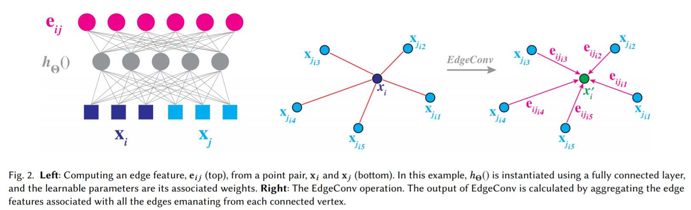

time: 20191121
pdf_source: https://arxiv.org/pdf/1801.07829.pdf
code_source: https://github.com/WangYueFt/dgcnn
short_title: DGCNN and edgeConv
# Dynamic Graph CNN for Learning on Point Clouds

这篇论文提出了edgeConv作为新的pointNet操作符,它的特点在于考虑了点的坐标以及相邻点的距离。这里推荐[中文论文笔记](https://blog.csdn.net/hongbin_xu/article/details/85258278)

## EdgeConv

直觉介绍，由于每一个点的特征经常包含坐标、颜色的信息，本文的算法是显式地让相邻的点直接相互融合运算，这样方便得到两者的差或者两者的均值，这也是本文edgeConv的名字来源。

定义边缘特征$e_{ij} = h_{\Theta}(x_i,x_j)$其中$h_{\Theta}$为可学习的非线性函数，这会输出$F'$个特征，当前点的输出为附近多个相邻边缘值的综合，可以是求和也可以是求最大值。

对$h_{\Theta}$的定义也是多样化的，1.对单个对方点的加权求和;2.对本地点特征的加权求和(与pointNet一致);3.$h_{\Theta}(x_i,x_j) = h_\Theta(x_j - x_i)$这样就只会有局部信息差值而缺少全局信息(当前点的全局位置);4. $h_\Theta(x_i,x_j) = h_\Theta(x_i, x_j - x_i)$从而综合全局与局部信息，也是主流选择。(原论文还提到一种使用高斯核的方法，这里省略)

综合不同边缘的运算符选择的是max，这样整个计算可以用一个共享参数的MLP实现。

## 动态重组
一些传统的pointnet会将点的位置固定下来，每次的卷积都只在点原来的相邻边中挑选。本文的思路是每层运算后，用新的特征作为feature vector，在整个点云中重新进行KNN运算找在新特征条件下最靠近的点。如此以来每一层运算后点的邻域都会被洗乱。

## 网络总体结构

以PointNet为基础。具体可以观察代码以及图片解释。