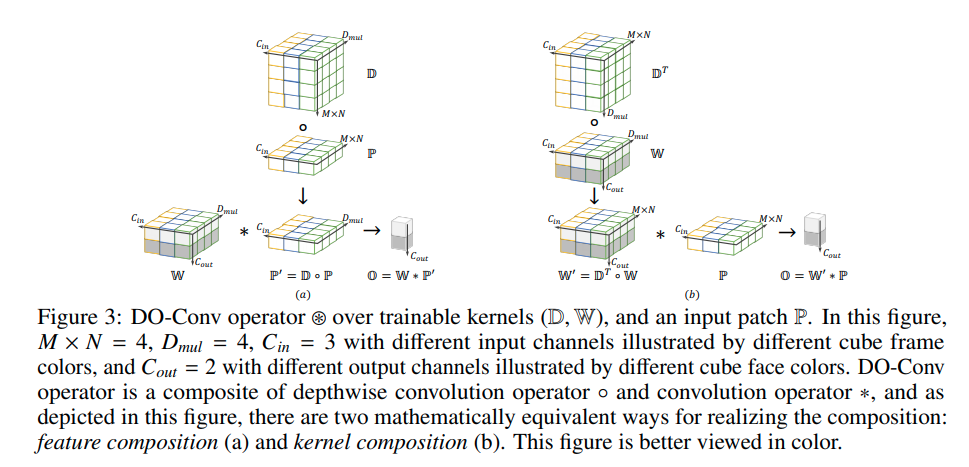

time: 20200629
pdf_source: https://arxiv.org/pdf/2006.12030v1.pdf
code_source: https://github.com/yangyanli/DO-Conv
short_title: DO-Conv

# DO-Conv: Depthwise Over-parameterized Convolutional Layer

作者引入了over-parameterized的卷积层，这种卷积层的好处是在training的时候容易训练，在inference的时候可以将宽参数融合，得到单个卷积层进行推理。

$$\begin{aligned}
\mathbb{O} &=(\mathbb{D}, \mathbb{W}) \otimes \mathbb{P} \\
&=\mathbb{W} *(\mathbb{D} \circ \mathbb{P}) \quad \text { (Fig. 3-a, feature composition) } \\
&=\left(\mathbb{D}^{T} \circ \mathbb{W}\right) * \mathbb{P}, \quad \text { (Fig. 3-b, kernel composition) }
\end{aligned}$$