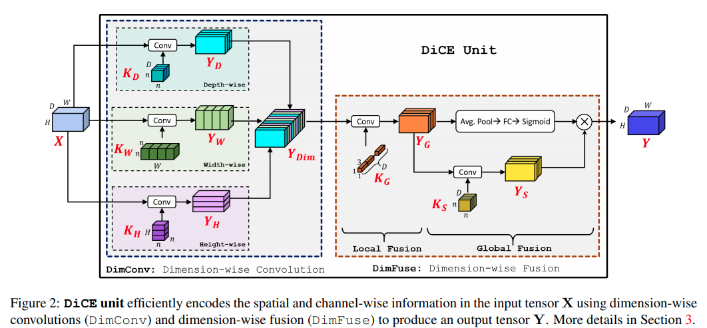
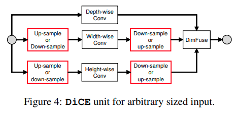

time: 20191216
pdf_source: https://arxiv.org/pdf/1906.03516.pdf
code_source: https://github.com/sacmehta/EdgeNets
short_title: DiCENet

# DiCENet: Dimension-wise Convolutions for Efficient Networks

这篇论文提出了DiCE模块，DiCE模块是可以理解为是升级版的pointwise convolusion(每个spatial location不同卷积核)或者[depthwise convolution](../3dDetection/M3D-RPN_Monocular_3D_Region_Proposal_Network_for_Object_Detection.md)(本文作者将其理解为Height-wise convolution)

目前这里选读这一篇是因为看好它在单目3D检测中的潜力。因为它在多个轴上分组卷积，会彻底打破系统的平移不变性以及对称性。

## DiCE unit

depth-wise convolution指代的是基础的分组卷积

width-wise convolution与height-wise的算法是将对应维度旋转到dim=1处(pytorch cnn默认的特征维度)，然后直接分组CNN

再transpose回去，三个分支得到三个$C H W$ 的矩阵

合并的方法，作者代码的算法是先torch.cat,然后执行[channel shuffle].直接糅合起来的代码是stack(dim=2) -> reshape

合并之后使用分组卷积融合来自不同分支的特征，此后再分支，模仿的是[Squeeze_and_excitation](Squeeze-and-Excitation&#32;Networks.md).其中一个分支通过spatial平均与FC连接得到channel wise的权重，然后做一个分组卷积得到$Y_S$，两者相乘输出。

## 不同形状的输入

本文这里使用的是pytorch的自适应avgpool来具体实现。

[channel shuffle]:https://blog.csdn.net/u011974639/article/details/79200559