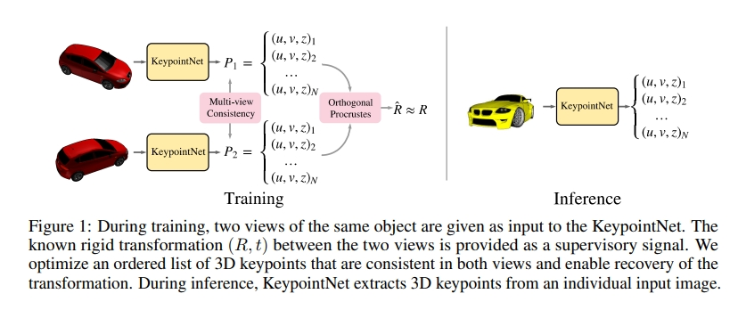

time: 20191025
pdf_source: https://arxiv.org/pdf/1807.03146.pdf
code_source: https://github.com/tensorflow/models/tree/master/research/keypointnet
short_title: keypointNet
# Discovery of Latent 3D Keypoints via End-to-end Geometric Reasoning

这篇论文完成的任务是，对单张图片输出一系列有序的keypoints，这些keypoints在不同视角下有相同的表达。训练时则通过同一物体不同视角的一对图片进行训练。

## 主体Pipeline

已知的相对刚体运动作为监督信号。inference的时候，KeypointNet从单个输入图中输出3D关键点

## 具体介绍

一个3D keypoint被定义为像素坐标加上对应的深度值。网络输出
N个分支，预测N个关键点。

目标函数由两个部分组成

### Multi-view Consistency

描述两组点在ground truth转换前后点的距离

$$
\begin{aligned}[\hat{u}, \hat{v}, \hat{z}, 1]^{\top} & \sim \pi T \pi^{-1}\left([u, v, z, 1]^{\top}\right) \\\left[\hat{u}^{\prime}, \hat{v}^{\prime}, \hat{z}^{\prime}, 1\right]^{\top} & \sim \pi T^{-1} \pi^{-1}\left(\left[u^{\prime}, v^{\prime}, z^{\prime}, 1\right]^{\top}\right) \end{aligned}
$$

$$
\pi\left([x, y, z, 1]^{\top}\right)=\left[\frac{f x}{z}, \frac{f y}{z}, z, 1\right]^{\top}=[u, v, z, 1]^{\top}
$$

$$
L_{\mathrm{con}}=\frac{1}{2 N} \sum_{i=1}^{N}\left\|\left[u_{i}, v_{i}, u_{i}^{\prime}, v_{i}^{\prime}\right]^{\top}-\left[\hat{u}_{i}^{\prime}, \hat{v}_{i}^{\prime}, \hat{u}_{i}, \hat{v}_{i}\right]^{\top}\right\|^{2}
$$

本质上就是将A图上的点转换到B图上求差值，再将B图上的点转换到A图上求差值，求和。

### 相对姿态估计。

这里只要求对估计的旋转矩阵计算loss

$$
L_{\mathrm{pose}}=2 \arcsin \left(\frac{1}{2 \sqrt{2}}\|\hat{R}-R\|_{F}\right)
$$

其中估计$\hat R$,令$X$和$X'$指代两个图计算出来的keypoints的$X \equiv\left[X_{1}, \ldots, X_{N}\right]$ and $X_{i} \equiv\left(\pi^{-1} p_{i}\right)[: 3]$

$$
\hat{R}=V \operatorname{diag}\left(1,1, \ldots, \operatorname{det}\left(V U^{\top}\right)\right) U^{\top}
$$

$$
U, \Sigma, V^{\top}=\operatorname{SVD}\left(\tilde{X} \tilde{X}^{\prime \top}\right)
$$

这个方法被称为[Procrustes problem](http://www.entsphere.com/pub/pdf/aGeneralizedSolutionOfTheOrthogonalProcrsutesProblem.pdf)

SVD是可以backprob的实现的(同样使用可微分SVD的[这篇文章](../other_categories/SLAM/DeepICP:_An_End-to-End_Deep_Neural_Network_for_3D_Point_Cloud_Registration.md)也提到tensorflow有可微分SVD)

## KeypointNet 结构

本文使用的KeypointNet,一个重要的性质在于平移等价，也就是说平移一个像素，输出位置也会移动一个单位。要求输出heatmap $g_i(u,v)$代表第$i$个keypoint出现在$(u,v)$,要求$\sum_{u,v}g_i(u,v)=1$使用spatial softmax去实现。

用加权平均求出对应keypoint的位置以及深度
$$
[u_i,v_i]^T = \sum_{u,v}[u * g_i(u,v), v * g_i(u,v)]^T
$$

$$
z_i = \sum_{u,v}d_i(u,v)g_i(u,v)
$$

## 辅助training

分离loss:对过于靠近的keypoints给一个loss

$$
L_{\mathrm{sep}}=\frac{1}{N^{2}} \sum_{i=1}^{N} \sum_{j \neq i}^{N} \max \left(0, \delta^{2}-\left\|X_{i}-X_{j}\right\|^{2}\right)
$$

轮廓一致性:鼓励keypoints在物体内部，原因是training的时候能得到图片每一个坐标是否对应一个object，这个mask标记为$b(u,v)\in{0,1}$

$$
L_{obj} = \frac{1}{N}\sum^N_{i=1} - log\sum_{u,v}b(u,v)g_i(u,v)
$$

