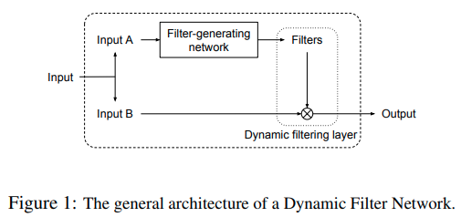
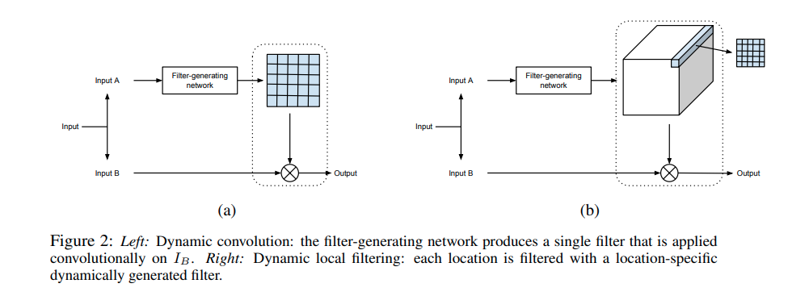

code_source: https://github.com/dbbert/dfn
time:20200214
pdf_source: https://arxiv.org/pdf/1605.09673.pdf
short_title: Dynamic Filtering Network
# Dynamic Filter Networks

这篇2016的NIPS论文探讨的是动态卷积核的问题.原文的官方库是基于Theano的，后来也有了[tensorflow implementation].概念不算复杂。

## 结构与模块组成

简单来说就是让输入一方面作为被卷积的常规输入，另一方面又使用网络生成卷积核。

这里有两种实现方式，第一种是整个Feature map只输出一个single Convolution Kernel,然后卷积也会与一般的卷积一致。

第二种是在feature map每一个点上用常规卷积生成9(3x3)个特征,然后每一个点上用各自的计算得到的特征再计算卷积。

作者指出这个结构与Residual连接有一定相似之处。

[tensorflow implementation]:https://github.com/LiamMaclean216/Dynamic_Filters/blob/master/Dynamic%20Filter.ipynb