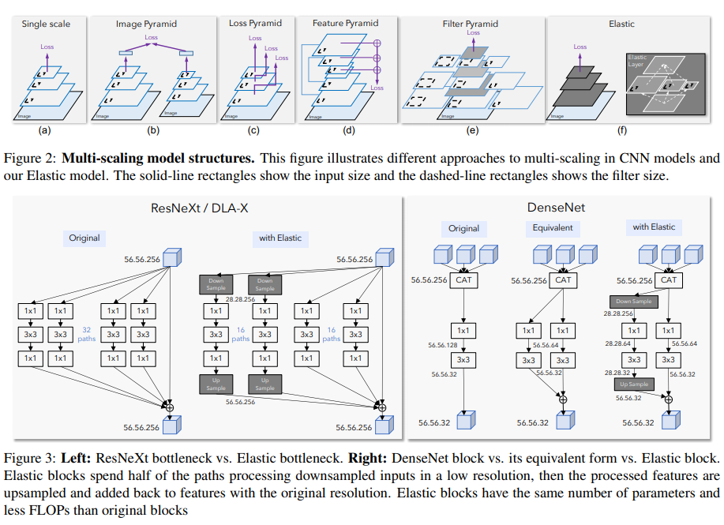

code_source: https://github.com/allenai/elastic
pdf_source: https://arxiv.org/pdf/1812.05262.pdf
short_title: Elastic: Dynamic Scaling CNNs
# ELASTIC Improving CNNs With Dynamic Scaling Policies

这篇论文的想法非常简单，简单来说就是要让网络能够自主学习在inference过程中采取怎样的scale，做法是在Resnet的一个分支中，先downsample，做卷积，再upsample。同时保留原scale的通路，由训练过程来让网络决定应该如何配置两个通路的参数，以此决定scale.

本文进一步还给出了目前多种multiscale model的结构，图非常的好看且inspiring