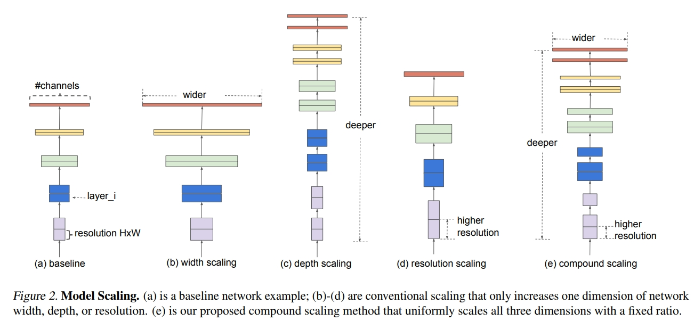
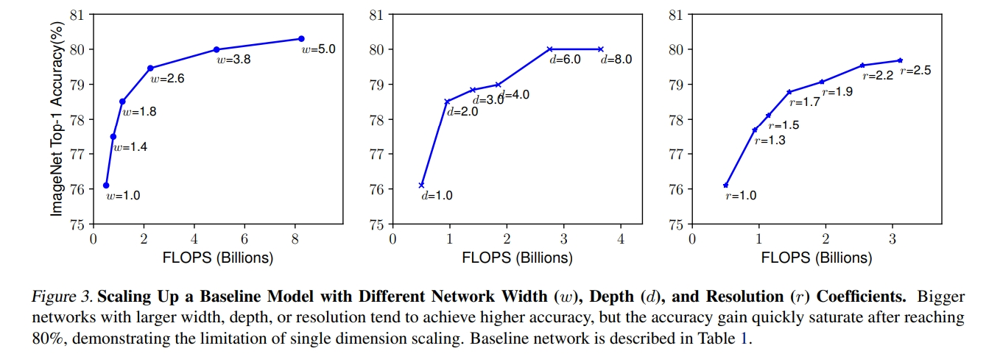
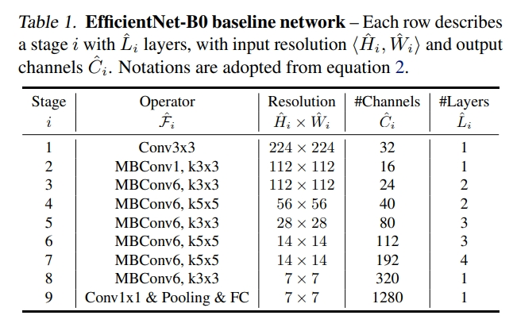
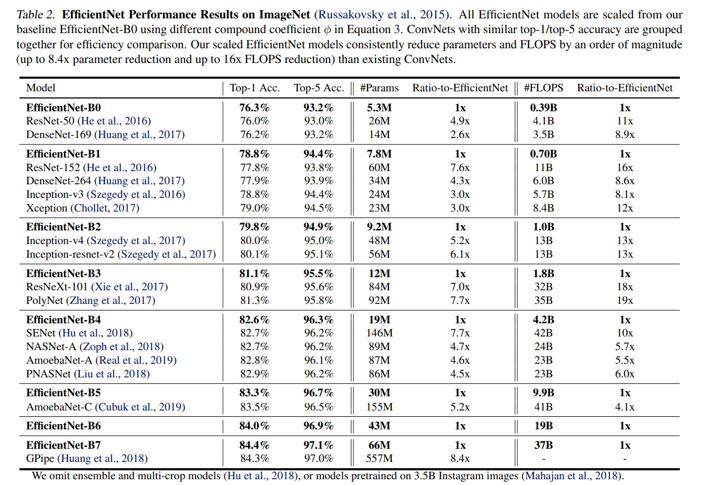
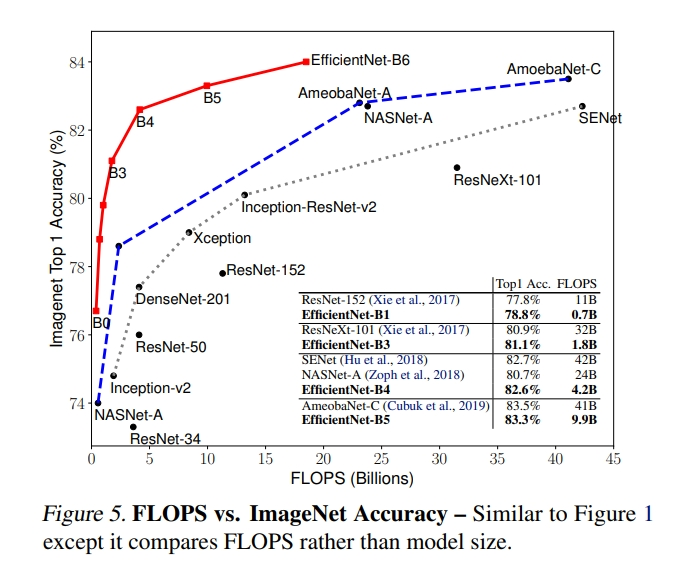

time: 20191028
pdf_source: https://arxiv.org/pdf/1905.11946.pdf
code_source: https://github.com/qubvel/efficientnet#about-efficientnet-models
short_title: EfficientNet
# EfficientNet: Rethinking Model Scaling for Convolutional Neural Networks

这篇文章分析了CNN Scale Up的相关原理，然后给出EfficientNet.背后的逻辑是这样的，首先我们可以通过Neural Architecture Search得到一个低分辨率图片的高效率模型，然后依据它对应的Scale Up原理进行扩展。本文用到的baseline出自[MnasNet(pdf)](https://arxiv.org/pdf/1807.11626.pdf),就是通过NAS得到的。本文的[代码](https://github.com/qubvel/efficientnet#about-efficientnet-models)提供了keras以及Tensorflow实现。这个[repo提供了pytorch实现](https://github.com/lukemelas/EfficientNet-PyTorch)

这里添加一个[medium上的解读](https://medium.com/@fanzongshaoxing/%E6%96%87%E7%AB%A0%E8%A7%A3%E8%AF%BB-efficientnet-rethinking-model-scaling-for-convolutional-neural-networks-icml2019-b55ee9720a4a).

## Model Scaling Observation

上图展示的是不同的scale up一个模型的方式。本文的结论是应该根据输入图片的分辨率、channel数目以及网络深度综合Scale Up得到的提升才是最明显的。

上图展示的是分别只Scale Up网络channel数,网络深度,以及图片分辨率得到的。作者的结论是只Scale Up一个因子很容易得到Saturation，通过另一个实验发现总合一起Scale Up能得到更好的结果。

## Compound Scaling Method

$$
\begin{aligned} \text { depth: } d &=\alpha^{\phi} \\ \text { width: } w &=\beta^{\phi} \\ \text { resolution: } r &=\gamma^{\phi} \\ \text { s.t. } \alpha & \cdot \beta^{2} \cdot \gamma^{2} \approx 2 \\ \alpha & \geq 1, \beta \geq 1, \gamma \geq 1 \end{aligned}
$$

作者选择这个的原因是因为FLOPS(浮点运算数)正比于深度,频道数的平方以及分辨率的平方。

## Efficient Net

EfficientNet的基本单元由[Mobile Conv(pdf)](https://arxiv.org/pdf/1801.04381.pdf)组成。

从这个BaseLine开始，通过小grid-search得到$\alpha, \beta, \gamma$的初始值,更改$\phi$得到不同的channel数,分辨率以及网络层数(网络层数的更改是通过更改堆叠MBConv的一个for循环的循环次数实现的)

## 实验与结果

本文首先尝试Scale Up了MobileNet以及ResNet的到好的结果，然后开始Scale Up EfficientNet,
以下图中各个网络的准确率、参数以及FLOPS是一个很好的参考.

