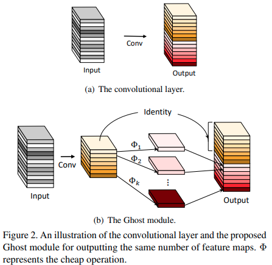

time: 20200227
pdf_source: https://arxiv.org/pdf/1911.11907.pdf
code_source: https://github.com/iamhankai/ghostnet.pytorch
short_title: Ghost Net

# GhostNet: More Features from Cheap Operations



```python
class GhostModule(nn.Module):
    def __init__(self, inp, oup, kernel_size=1, ratio=2, dw_size=3, stride=1, relu=True):
        super(GhostModule, self).__init__()
        self.oup = oup
        init_channels = math.ceil(oup / ratio)
        new_channels = init_channels*(ratio-1)

        self.primary_conv = nn.Sequential(
            nn.Conv2d(inp, init_channels, kernel_size, stride, kernel_size//2, bias=False),
            nn.BatchNorm2d(init_channels),
            nn.ReLU(inplace=True) if relu else nn.Sequential(),
        )

        self.cheap_operation = nn.Sequential(
            nn.Conv2d(init_channels, new_channels, dw_size, 1, dw_size//2, groups=init_channels, bias=False),
            nn.BatchNorm2d(new_channels),
            nn.ReLU(inplace=True) if relu else nn.Sequential(),
        )

    def forward(self, x):
        x1 = self.primary_conv(x)
        x2 = self.cheap_operation(x1)
        out = torch.cat([x1,x2], dim=1)
        return out[:,:self.oup,:,:]


class GhostBottleneck(nn.Module):
    def __init__(self, inp, hidden_dim, oup, kernel_size, stride, use_se):
        super(GhostBottleneck, self).__init__()
        assert stride in [1, 2]

        self.conv = nn.Sequential(
            # pw
            GhostModule(inp, hidden_dim, kernel_size=1, relu=True),
            # dw
            depthwise_conv(hidden_dim, hidden_dim, kernel_size, stride, relu=False) if stride==2 else nn.Sequential(),
            # Squeeze-and-Excite
            SELayer(hidden_dim) if use_se else nn.Sequential(),
            # pw-linear
            GhostModule(hidden_dim, oup, kernel_size=1, relu=False),
        )

        if stride == 1 and inp == oup:
            self.shortcut = nn.Sequential()
        else:
            self.shortcut = nn.Sequential(
                depthwise_conv(inp, inp, 3, stride, relu=True),
                nn.Conv2d(inp, oup, 1, 1, 0, bias=False),
                nn.BatchNorm2d(oup),
            )
    def forward(self, x):
        return self.conv(x) + self.shortcut(x)
```