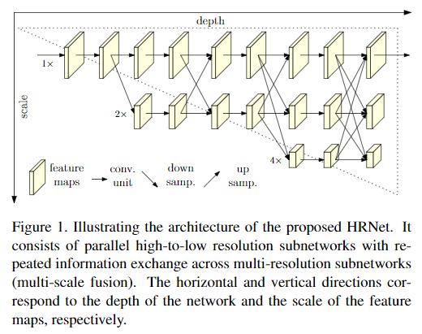

code_source: https://github.com/leoxiaobin/deep-high-resolution-net.pytorch
pdf_source: https://arxiv.org/pdf/1902.09212.pdf
short_title: HRNet
# Deep High-Resolution Representation Learning for Human Pose Estimation

这篇论文给出HRnet,思路关键是保留不同scale的feature map，并在前传过程中让他们交换信息。

