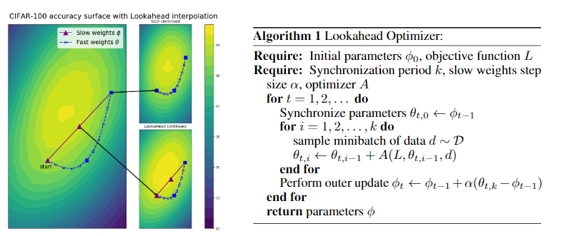
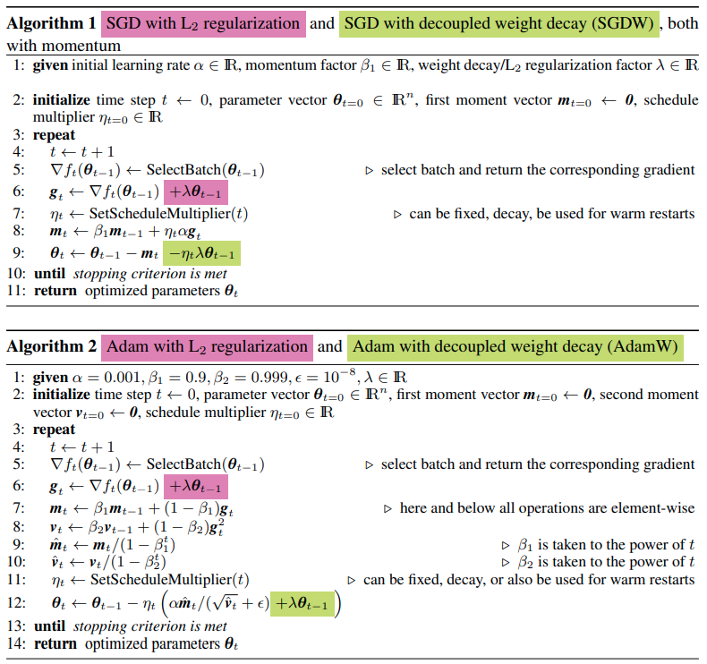

pdf_source: https://arxiv.org/pdf/1907.08610.pdf
short_title: New Optimizers
code_source: https://github.com/lessw2020/Ranger-Deep-Learning-Optimizer
time: 20200415

# New Optimizers

目录中的代码仓库指向Ranger库，是一个融合了多个optimizer的库。各篇文章有自己的官方开源库。

## Lookahead Optimizer:ksteps forward, 1 step back

[pdf](https://arxiv.org/pdf/1907.08610.pdf) [code](https://github.com/alphadl/lookahead.pytorch)



本质上来说就是保存两套参数值，用一套参数值正常更新N步(每变一次需要使用新的权值计算更新方向)，然后用第二套参数往最终这N步的总更新方向走一步

## Gradient Centralization: A New Optimization Technique for Deep Neural Networks

[pdf](https://arxiv.org/pdf/2004.01461v2.pdf) [code](https://github.com/Yonghongwei/Gradient-Centralization)

计算方式很简单，就是计算graident之后，在update之前normalize全局gradient
```python
for p in group['params']:
    d_p = p.grad.data
    d_p.add_(-d_p.mean(dim = tuple(range(1,len(list(d_p.size())))), keepdim = True))
```

这种训练方式要求网络的权重的均值一直是不变的，也就是regularize了权重的搜索空间.作者也证明这种写法会regularize feature output space.但是kaiming init 还有imagenet pretrained的权重值都不会太大，所以这个regularization不会轻易崩。

## Decoupled Weight Decay Regularization
[pdf](https://arxiv.org/pdf/1711.05101.pdf) [code](https://pytorch.org/docs/stable/generated/torch.optim.AdamW.html#torch.optim.AdamW)

这篇paper提出的AdamW主要的特点是将weight decay从优化中解耦合。

定义:

- L2 Regularization指的是在Loss function上加上weight square.
- weight decay指的是在更新权重的时候额外减去weight的大小.

理论与实验前置结论:

- L2 Regularization 与 weight decay效果有不同。 这是因为Adam的特性造成的，在SGD时是一样的。
- 使用Adam的时候，L2 regularization效果不好。
- 对于SGD和Adam, weight decay一样好.


