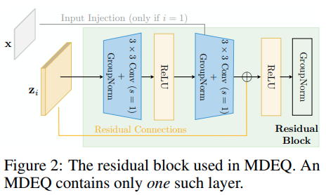

time: 20200622
pdf_source: https://arxiv.org/pdf/2006.08656v1.pdf
code_source: https://github.com/locuslab/mdeq
short_title: MDEQ

# Multiscale Deep Equilibrium Models

我在这篇paper里面读到了一个叫做 *Implicit Deep Learning*的概念。目前主要的深度学习网络，它们的forward pass是预设定好的，而backward pass则是一句forward的运算图反向计算。而Implicit Deep Learning的特点在于forward pass的运算并不是完全预先定义好的，而是会有一个终态标准，网络在实现这一终态标准之后完成这一层的运算，而网络的backward pass则是根据这一终态标准获取的，与forward pass的过程无关。

## Deep Equilibrium 深度均衡

### Motivation:

对于一个$L$层的权重共享的网络来说，它的运算可以表达为
$z^{[i+1]} = f_\theta(z^{[i]};x)$
如果$L$数量趋近于无穷，则最终结果会趋向于一个均衡态$z^* = f_\theta(z^*;x)$.这个设定的好处有二，首先是Forward结果计算可以被理解为一个不动点的寻找$z^* = Rootfind(f_\theta(z;x) - z)$,我们可以使用牛顿法逼近不动点的根。其次，在backward的时候可以直接对稳定态进行反传

$$\frac{\partial \ell}{\partial \theta}=\frac{\partial \ell}{\partial \mathbf{z}^{\star}}\left(-\left.J_{g_{\theta}}^{-1}\right|_{\mathbf{z}^{\star}}\right) \frac{\partial f_{\theta}\left(\mathbf{z}^{\star} ; \mathbf{x}\right)}{\partial \theta} \quad \frac{\partial \ell}{\partial \mathbf{x}}=\frac{\partial \ell}{\partial \mathbf{z}^{\star}}\left(-\left.J_{g_{\theta}}^{-1}\right|_{\mathbf{z}^{\star}}\right) \frac{\partial f_{\theta}\left(\mathbf{z}^{\star} ; \mathbf{x}\right)}{\partial \mathbf{x}}$$

由于雅克比矩阵计算的复杂性，前文仅在序列模型中尝试，本文尝试将其扩展到图片中

### 结构

代码呈现的逻辑是把multi-scale resolution理解为一个无限次的convolution block，求解器需要做的是就是求出图中$f_\theta$的不动点,对于pytorch函数g的核心代码在[broyden.py](https://github.com/locuslab/mdeq/blob/master/lib/modules/broyden.py#L122),代码完全为python/pytorch计算。
