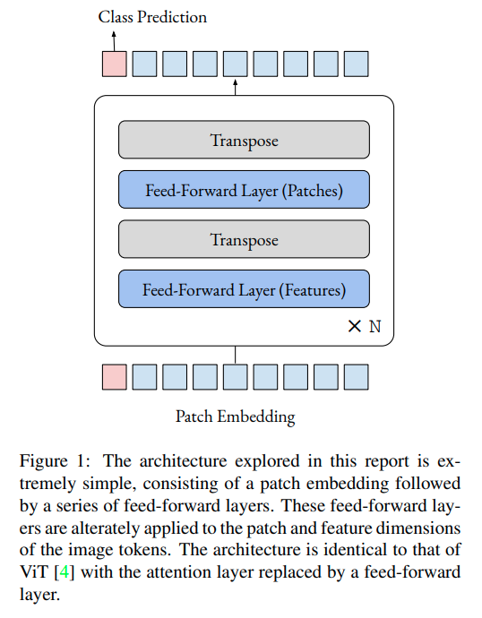
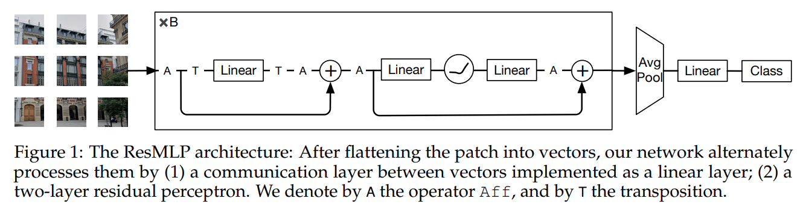
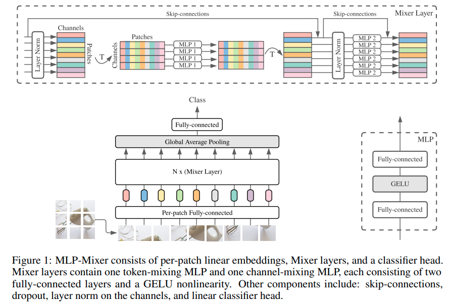

time: 20210510
pdf_source: https://arxiv.org/pdf/2105.02723.pdf
code_source: https://github.com/lukemelas/do-you-even-need-attention

# MLP in Image Classification

使用全连接层实现Imagenet级别的图片分类。这个Idea在相近的时间内被多个不同的组别实现并训练出成果，他们几乎是同时发布了文章.

要理解这一趋势，首先发现的是 [ICLR](../other_categories/Summaries/Summary_ICLR_2021.md)里使用Visual Transformer直接进行图片分类的work，这个方法接近于bag of positional-encoded words进行分类，结果出来结果还不错。

有充分算力的几个大组，Facebook/Google/牛津在相近的时间内分布了三个文章，都是使用全连接层直接实现图片分类。

## Do You Even Need Attention? A Stack of Feed-Forward Layers Does Surprisingly Well on ImageNet
[pdf](https://arxiv.org/pdf/2105.02723.pdf) [code](https://github.com/lukemelas/do-you-even-need-attention)

牛津的方案非常简单，将Transformer里面的Attention部分直接变成全连接层就可以了.

## ResMLP: Feedforward networks for image classification with data-efficient training
[pdf](https://arxiv.org/pdf/2105.03404.pdf)

这篇文章带有更多的残差链接，全连接层也更多。本文声称训练过程比ViT要更稳定。

## MLP-Mixer: An all-MLP Architecture for Vision
[pdf](https://arxiv.org/pdf/2105.01601.pdf) [code](https://github.com/google-research/vision_transformer)

本文提出了两种MLP层，一个是*channel-mixing MLP*, 一个是 *token-mixing MLP*. channel指的是每一个patch区域的特征的融合，token指的是不同patch区域之间的相互信息融合。

