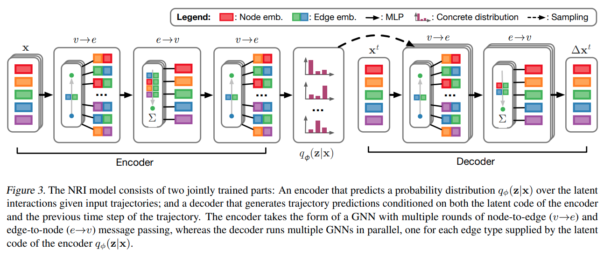
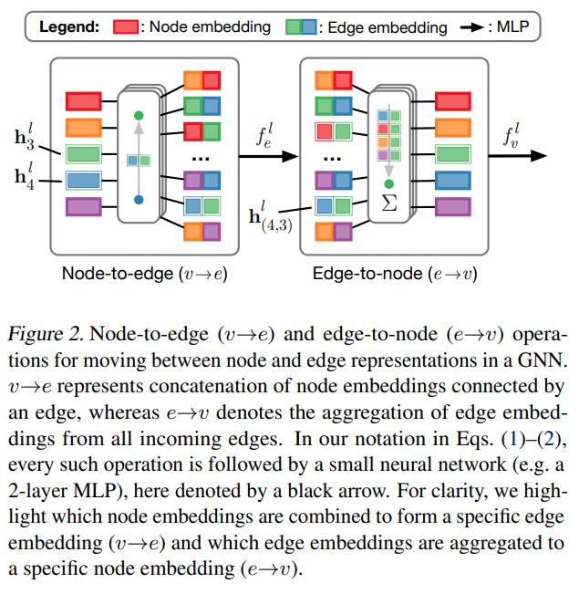

time: 20201125
pdf_source: https://arxiv.org/pdf/1802.04687.pdf
code_source: https://github.com/ethanfetaya/nri
short_title: Neural Relational Inference Model (NRI)

#  Neural Relational Inference for Interacting Systems

这篇paper的作者写了一个[tutorial](https://medium.com/sap-machine-learning-research/building-models-that-learn-to-discover-structure-and-relations-28971933ebe9)

<iframe title="vimeo-player" src="https://player.vimeo.com/video/275504630" width="640" height="640" frameborder="0" allowfullscreen></iframe>

这个模型的目的就是拟合一个系统的物理模型， 同时要求显示地学习不同节点(states)之间的相互约束.正如上方的视频.

## Neural Relational Inference Model

网络结构如图，整个系统采用的是一个variational autoencoder的设计. 其中 $v\rightarrow e$的思路是说将$N$个节点拼接起来，形成一个$N\times N$的矩阵 (主对角线部分为零). $e\rightarrow v$的思路是将行求和.

本文这里对 $q_\phi(z_{ij}|x)$设定为 $q_\phi(z_{ij}|x) = \text{softmax}(f_{enc,\phi}(x)_{ij, 1:K})$ 

