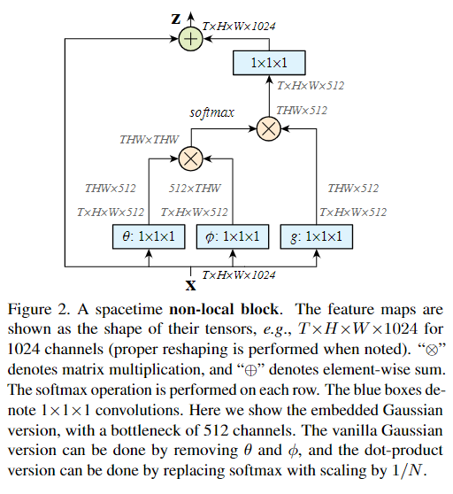

# Non-local Neural Networks

non-local单元是另一个可以显著提高3D,2D卷积网络的感受野

## 模块结构

图中给出的是简洁明了的non-local模块的具体算法。每一个蓝色的[1x1x1]表明一次channel-wise Conv。

以下为几个直觉以及引申
1. 在图中删除T维度不影响全图结构与可行性，也不影响效果，因而non-local也可以用于图片。
2. non_local核心是$f(x_i,x_j) = e^{x_i^T x_j}$,直觉上来说，会让不同时空位置上相似的特征得到较高的激活值，在后面也就使得图像上一个点的feature map可以融合与它相似的地方的信息。在视频处理中有一个辅助物体跟踪的效果。
3. 当feature map长宽比较小的时候效果好且运算速度快，但是当长宽很大的时候运算会很慢，因为会有数万维的矩阵相乘，运算图也会复杂。
4. 可以适当删改里面几个卷积操作以及softmax操作。