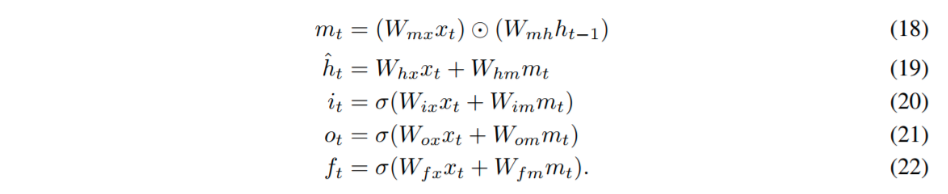

pdf_source: https://arxiv.org/pdf/1606.06630.pdf
code_source: https://github.com/titu1994/Keras-Multiplicative-LSTM
# On Multiplicative Integration with Recurrent Neural Networks

这篇论文提出一个在CAPs模型提出的[文章](../Planning_Control_DL/Composable_Action-Conditioned_Predictors_Flexible_Off-Policy_Learning_for_Robot_Navigation.md)中使用的Multiplicative Integration RNN(LSTM, GRU)

本质公式就是

$$
\phi\left(\boldsymbol{\alpha} \odot \mathbf{W} \boldsymbol{x} \odot \mathbf{U} \boldsymbol{z}+\boldsymbol{\beta}_{1} \odot \mathbf{U} \boldsymbol{z}+\boldsymbol{\beta}_{2} \odot \mathbf{W} \boldsymbol{x}+\boldsymbol{b}\right)
$$

其中$\odot$表示的是相同形状的矩阵之间的元素对应乘积，称为Hadamard product。

直觉是促进了两个信息源$x, z$的信息交流，同时优化$Uz$的梯度流通,这个在时序模型中较为重要。

这个[github](https://github.com/titu1994/Keras-Multiplicative-LSTM) repo提供了keras的执行。

具体公式的替换如下:

