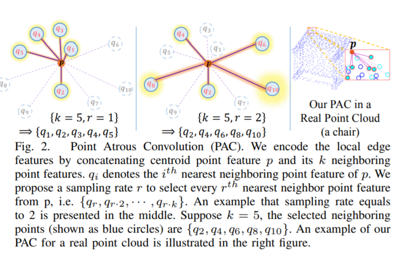
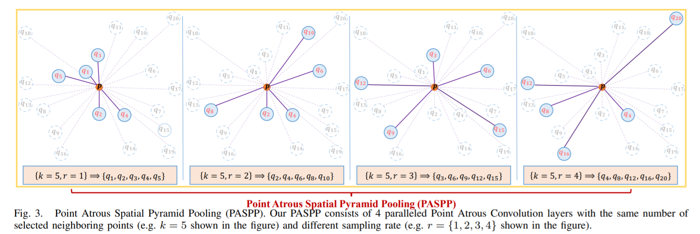
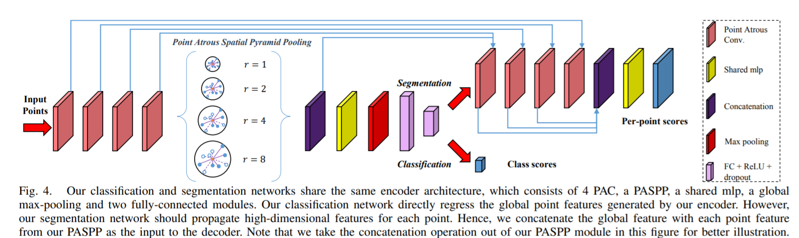

time:20191121
pdf_source:https://ieeexplore.ieee.org/document/8758990
code_source:https://github.com/paul007pl/PointAtrousGraph
short_title: PointAtrousNet
# PointAtrousNet: Point Atrous Convolution for Point Cloud Analysis

这篇论文将点云的空洞卷积引入点云分析中，值得留意的是空洞卷积在[这篇文章](Can&#32;GCNs&#32;Go&#32;as&#32;Deep&#32;as&#32;CNNs.md)中已经有提及，且本文并没有引用它，这里可能涉及一些时间上的差别，两者在点云空洞卷积上的计算较为相似，但是本文进一步提出了点云中的空洞池化，可以一看。

## 点云空洞卷积

与[这篇文章](Can&#32;GCNs&#32;Go&#32;as&#32;Deep&#32;as&#32;CNNs.md)相似，在每一个点附近寻找最靠近的K个点,这里与前文不同的地方在于这里采用的是edge convolution的操作，与[DGCNN.pdf](https://arxiv.org/pdf/1801.07829.pdf)类似的运算，[简介](DGCNN.md)
$$
X_{p}^{\prime}=g\left(H_{\Theta}\left(X_{p}, X_{q_{r}}\right), \ldots, H_{\Theta}\left(X_{p}, X_{\left.q_{(r, k)}\right)}\right)\right.
$$
其中$H_{\Theta} = h_{\theta}\left(X_{p} \oplus\left(X_{p}-X_{q_{i}}\right)\right)$
寻找临近点的方法也是构建KD树.

## 点云空洞池化

$$
\begin{aligned} X_{p}^{\prime} &=X_{p 1}^{\prime} \oplus X_{p 2}^{\prime} \oplus X_{p 3}^{\prime} \oplus X_{p 4}^{\prime} \\ X_{p i}^{\prime}=& g\left(H_{\rho}\left(X_{p}, X_{q_{r_{i}}}\right), \ldots, H_{\Theta}\left(X_{p}, X_{\left.q_{\left(r_{i}, k\right)}\right)}\right)\right.\end{aligned}
$$

## 完整网络示例

计算细节在图中以及代码中。