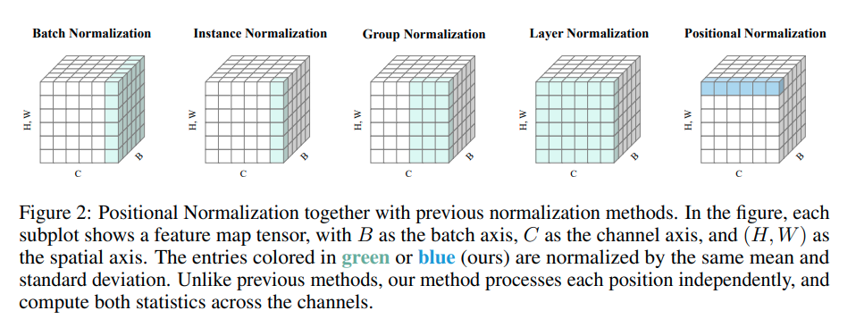
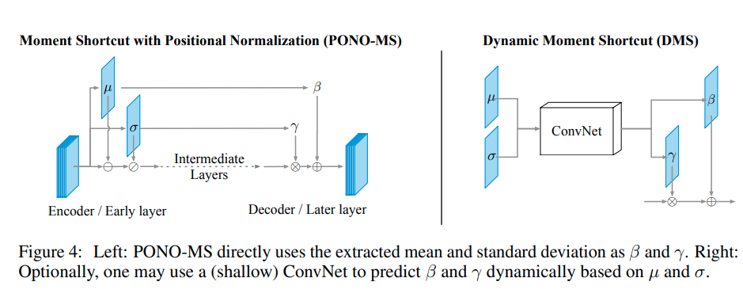

time: 20200412
pdf_source: https://papers.nips.cc/paper/8440-positional-normalization.pdf
code_source: https://github.com/Boyiliee/PONO
# Positional Normalization

这篇paper提供了一个随着不同position不同的normalization scheme

## Normalization Review and Positional Normalization



[代码](https://github.com/Boyiliee/PONO/blob/master/pono_ms_torch.py)
```python
import torch
# x is the features of shape [B, C, H, W]

# In the Encoder
def PONO(x, epsilon=1e-5):
    mean = x.mean(dim=1, keepdim=True)
    std = x.var(dim=1, keepdim=True).add(epsilon).sqrt()
    output = (x - mean) / std
    return output, mean, std
    
# In the Decoder
# one can call MS(x, mean, std)
# with the mean and std are from a PONO in the encoder
def MS(x, beta, gamma):
    return x * gamma + beta
```


## ShortCut in Generative Model



用于将输入信息传递到输出block中，能提升生成模型比如GAN的性能。