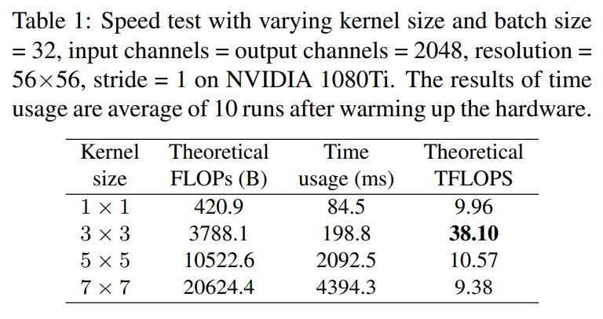
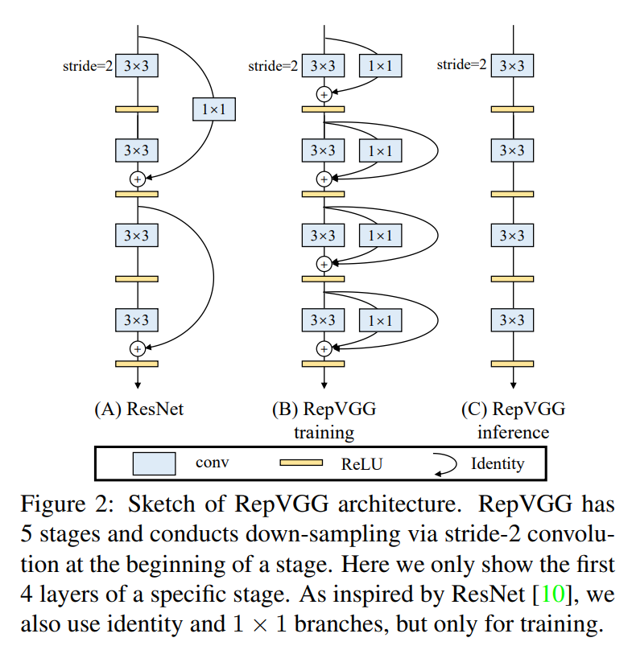
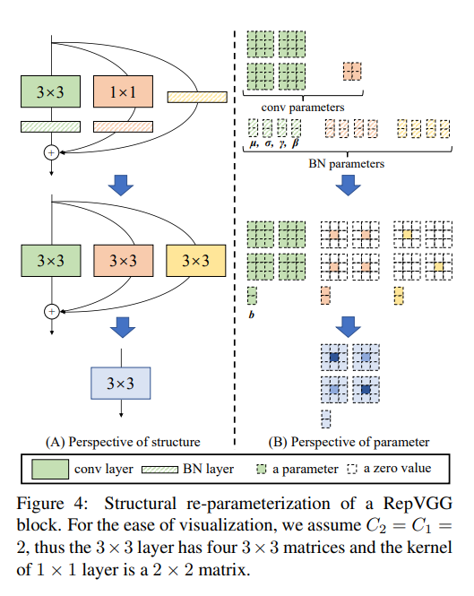

time:20210114
pdf_source:https://arxiv.org/pdf/2101.03697.pdf
code_source: https://github.com/megvii-model/RepVGG
short_title: RepVGG

# RepVGG: Making VGG-style ConvNets Great Again

这篇paper的直觉是简单而强大的。在推理的时候 $3x3$ 卷积是最快的也是最广泛支持的,也是运算在Winograd下优化最强大的。所以最好的推理网络应当是没有残差连接而纯粹使用 $3x3$ 卷积的。

但是VGG这样的纯粹卷积的网络，弱点在于在层数深的时候难以训练。

本文的提出的一个关键trick 可能启发自神经网络部署时的算子融合。也就是在训练的时候让网络使用残差连接，但是在推理的时候全部融合为单一CNN.

带上BN后的合成效果:

