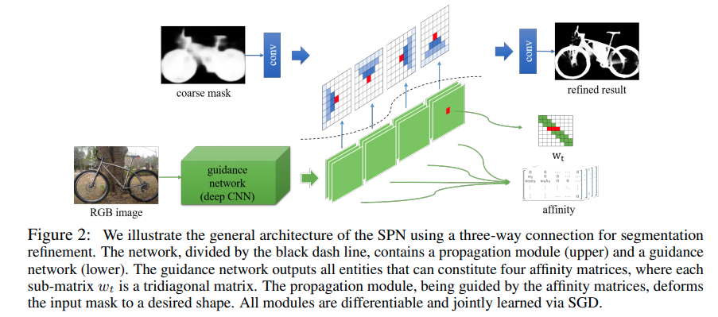
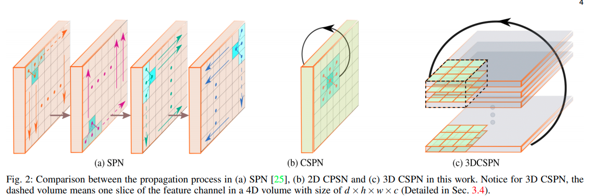

time: 20200406
pdf_source: https://arxiv.org/pdf/1810.02695.pdf
code_source: https://github.com/XinJCheng/CSPN/tree/24eff1296c282196f1c919714d8f32a9b0dbe7fb
short_title: SPN, CSPN and CSPN ++

# Spatial Propagation Network, Convolutional SPN and More

这篇文是SPN以及CSPN，CSPN++三篇paper的综述。在传统计算机视觉中，[Diffusion](https://www.wikiwand.com/en/Anisotropic_diffusion)是一个启发于自然扩散/渗透定律的处理算法，迭代地使用不同位置不同的kernel将某一点的信息扩散到附近的点上。

## Spatial Propagation Network
[pdf](https://arxiv.org/pdf/1710.01020.pdf) [code](https://github.com/danieltan07/spatialaffinitynetwork)

这篇NIPS paper，是第一个将Diffusion 深度学习化的paper。

### Spatial Propagation Basic

对于水平方向propagate的例子,设$x_t， h_t$为$n\times n$的特征图，$w_t$是$n\times n$的kernel矩阵(可以理解为一个参数矩阵), $d_t$是一个对角矩阵，
$$d_{t}(i, i)=\sum_{j=1, j \neq i}^{n} w_{t}(i, j)$$

那么迭代公式就是
$$h_{t}=\left(I-d_{t}\right) x_{t}+w_{t} h_{t-1}, \quad t \in[2, n]$$

将所有$t$次迭代写在一个$t\dot n \times t\dot n$矩阵里面，

$$H_{v}=\left[\begin{array}{ccccc}
I & 0 & \cdots & \cdots & 0 \\
w_{2} & \lambda_{2} & 0 & \cdots & \cdots \\
w_{3} w_{2} & w_{3} \lambda_{2} & \lambda_{3} & 0 & \cdots \\
\vdots & \vdots & \vdots & \ddots & \vdots \\
\vdots & \vdots & \cdots & \cdots & \lambda_{n}
\end{array}\right] X_{v}=G X_{v}$$

### Learning based Implementation

本文提出"three-way connection"，也就是每次传播会向上下左右3个pixel，分为四个分支，然后分别迭代执行。

开源代码只能支持方形矩阵(预设H==W, 比较的僵硬,这也导致了代码的注释一致性比较差)，因而具体implementation 此处略过

## Convolutional SPN
[pdf](https://arxiv.org/pdf/1810.02695.pdf) [code](https://github.com/XinJCheng/CSPN/tree/master)

这篇paper在双目以及Stereo中是一个很富裕的文章，其中理论比较新颖的地方是加入了CSPN模块以及它的3D形式。

[code](https://github.com/XinJCheng/CSPN/blob/master/cspn_pytorch/models/cspn.py)