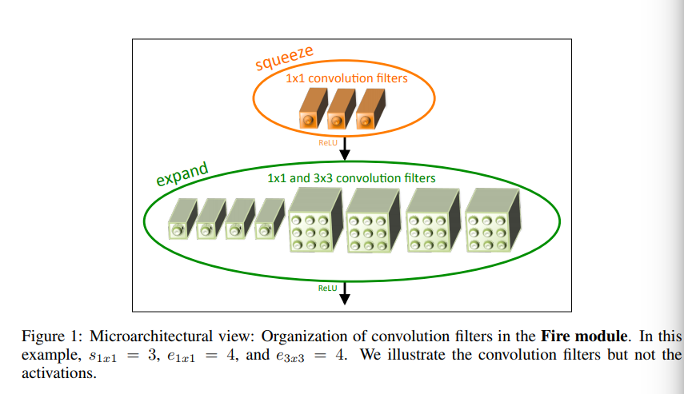
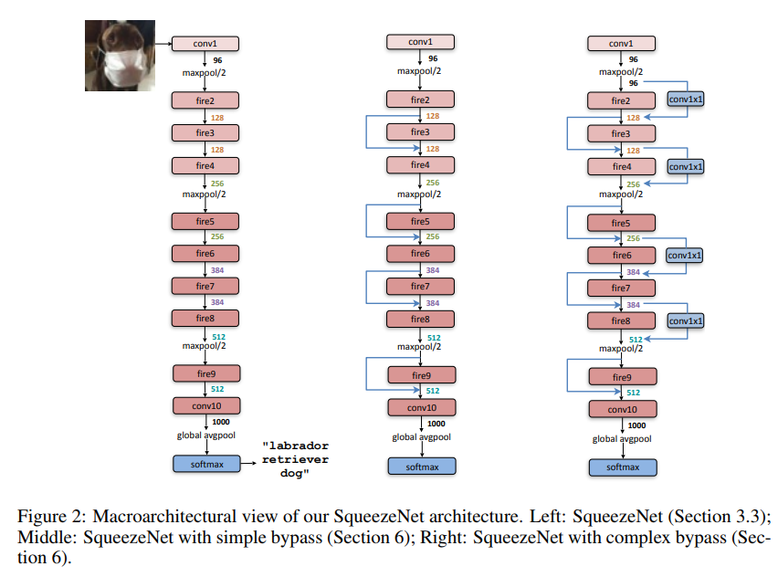

time: 20191010
pdf_source:https://arxiv.org/pdf/1602.07360.pdf
code_source:https://github.com/DeepScale/SqueezeNet
short_title: SqueezeNet
# SQUEEZENET: ALEXNET-LEVEL ACCURACY WITH 50X FEWER PARAMETERS AND <0.5MB MODEL SIZE

本文提出了体积小的网络有什么好处，并且给出了SqueezeNet的具体结构以及相关讨论

## 网络结构设计策略

1. 将$3\times 3$卷积核转换为$1\times 1$
2. 降低输入到$3\times 3$卷积的网络输入channel数
3. 在较后的位置再进行下采样，以此提升卷积层的FOV

## Fire Module

一个fire module由:
1. squeeze layer(仅有$1\times 1$卷积组成)
2. expand layer(混合$1\times 1$卷积与$3\times 3$卷积)

简单来说就是先用$1\times 1$卷积降低输入的channel数，然后将主输出的层部分用$1\times 1$
替代。

## SqueezeNet结构

本文第5章还进一步讨论了Fire Module还有宏观结构中的一系列具体参数。