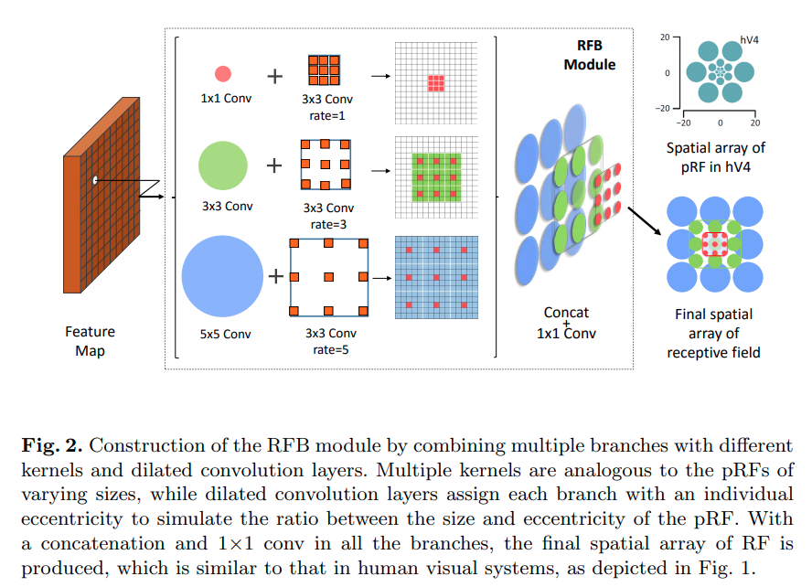
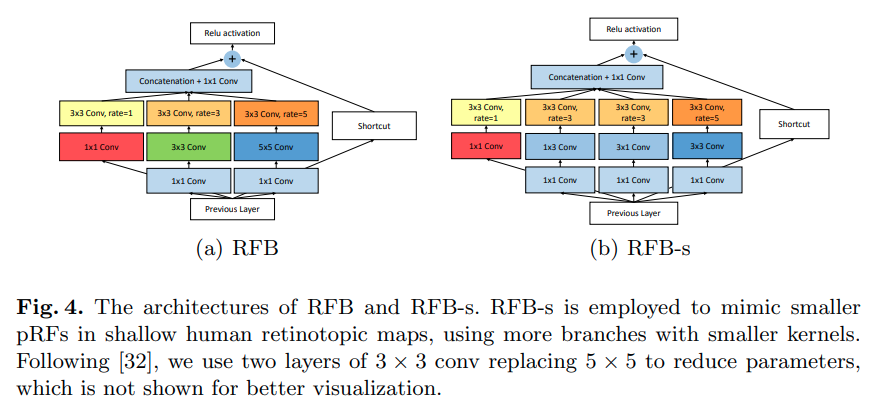
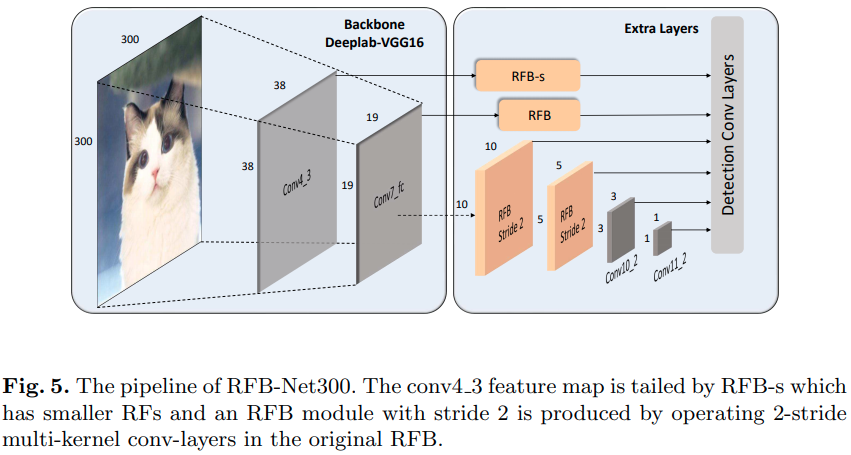

time: 20191216
pdf_source: https://eccv2018.org/openaccess/content_ECCV_2018/papers/Songtao_Liu_Receptive_Field_Block_ECCV_2018_paper.pdf
code_source: https://github.com/ruinmessi/RFBNet
short_title: Receptive Field Block
# Receptive Field Block Net for Accurate and Fast Object Detection

这篇文章的作者基于人眼实际细胞的感受野,设计了RFB模块用于分类与检测。

## RFB 模块感受野可视化

下图表示了,RFB模块的感受野与人类hV4眼细胞。

## RFB 执行结构

下图表达两种RFB模块的具体结构，它们分别近似人类深层与浅层视觉细胞的感受野特性。具体实现的使用使用两个串接的$3\times 3$卷积替代$5\times 5$卷积。

## RFB SSD

RFB结构在SSD中使用，作者提升了实时目标检测的性能。

