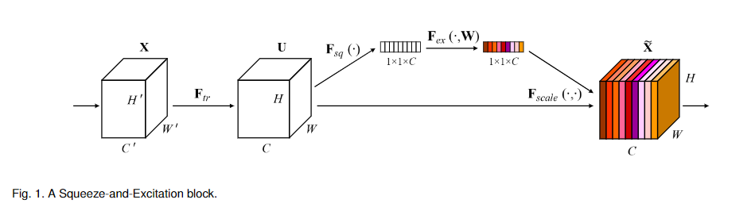

# Squeeze-and-Excitation Networks

这篇论文给出了squeeze-and-excitation方法来提高卷积的感受场大小。

## 计算单元结构

$F_{tr}$为基础卷积操作，$F_{sq}$为一个全图(H*W)的average pool.$F_{ex} = \sigma(W_2\sigma(W_1z))$，就是一个encoder、decoder的结构，$F_{scale}$则是一个channel-wise的点乘(scalar and a $H\times W$ feature map)

作者表示这可以理解为一个自注意力函数