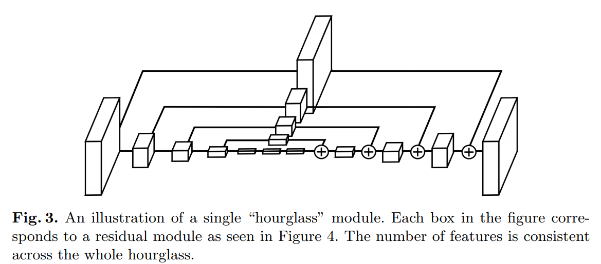

time: 20191013
pdf_source: https://arxiv.org/pdf/1603.06937.pdf
code_source: https://github.com/princeton-vl/pose-hg-train
short_title: Stacked Hourglass Networks
# Stacked Hourglass Networks for Human Pose Estimation

这篇文章目前对于本人来说是[这篇文章](../other_categories/object_detection_2D/CornerNet_Detecting_Objects_as_Paired_Keypoints.md)的前置.
目前(2019-10-13)，我们主要讨论本文提到的HourGlass 模块

## HourGlass

这个模块的设计起源于对多scale特征输出提取的需求。简单而言就是在每一个scale，进行分支，一部分执行一次卷积等待进一步使用。另一部分执行max-pooling下采样。去到最小featrue maps后，使用Neareast pooling上采样，与同scale的先前留下的残差进行element-wise相加

本文后面提到这里的卷积可以使用不同的方式实现，比如本文似乎就是使用一个复杂的Res结构实现的。具体还需要看代码。