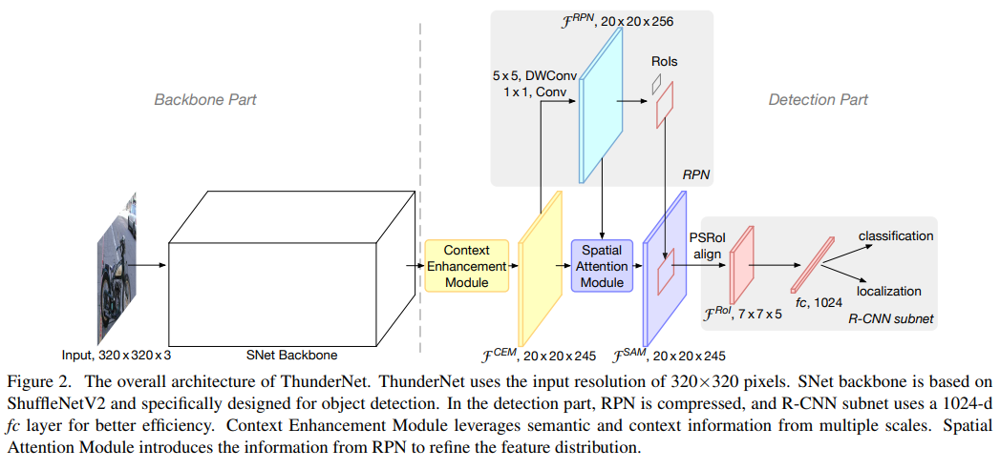
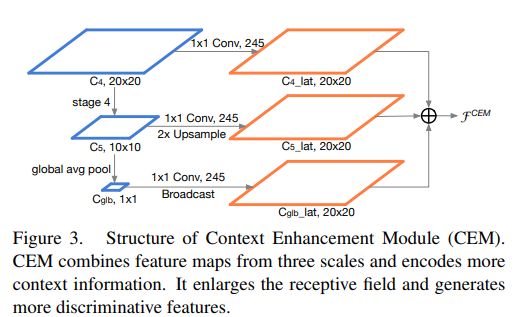

pdf_source: https://arxiv.org/pdf/1903.11752.pdf
time: 20191031
code_source: https://github.com/qixuxiang/Pytorch_Lightweight_Network
short_title: ThunderNet
# ThunderNet: Towards Real-time Generic Object Detection on Mobile Devices

这篇论文将一个two-stage的detection网络尽可能地轻量化以实现实时计算的目标，这篇文章[有一篇对读者很友好的Medieum解读，这里做一个引用](https://medium.com/@fanzongshaoxing/thundernet-towards-real-time-generic-object-detection%E6%96%87%E7%AB%A0%E8%A7%A3%E6%9E%90-c2f66cd0bf03).

与本网页其他文章一样，本文与其相比会更注重方法的解读。

## 总体PipeLine

其中SNet网络是基于[ShuffleNetV2](../The&#32;Theory/ShuffleNet&#32;V2:&#32;Practical&#32;Guidelines&#32;for&#32;Efficient&#32;CNN&#32;Architecture&#32;Design.md).默认的输入分辨率是$320\times320$,本文在backbone方面的提升主要是提升感受场的大小。

## Context Enhancement Module

这一个模型的运算在图中较为清楚，实质上就是用尽可能少的运算量，实现较为复杂多样的复合感受野。

## Spatial Attention Module

在RoI resize之前，实现对channel的一个reweights。

将这张图放回pipeline图中可以看到，$F^{RPN}$是CEM转换后的输出,作为RoIAlign的权重以及base bounding box的输出源，而这个模块最后给出的$F^{SAM}$是RoIAlign对应bounding box取内容输入到下一层的输出源。

## 实验结果

最浅的模块最终能在骁龙845上跑到25hz。

