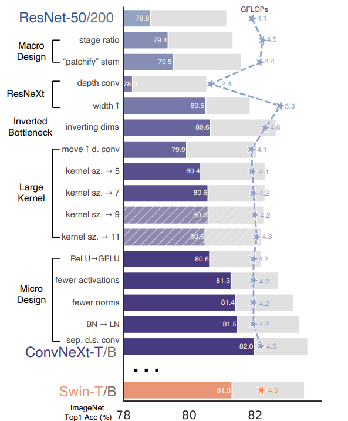
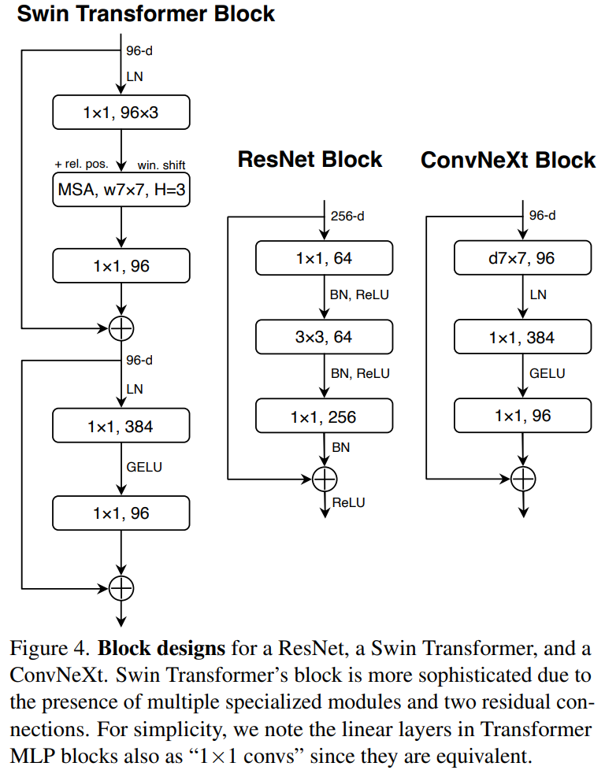

time: 20220113
pdf_source: https://arxiv.org/pdf/2201.03545.pdf
code_source: https://github.com/facebookresearch/ConvNeXt

# A ConvNet for the 2020s (ConvNeXt)

这篇paper的工作在于通过修改ResNet的一些基础设定使得它可以超越Transformer.

其实就是一个很简单的intuitition, 近年来ViT方面很多的进步在于[利用局部特征](../other_categories/Summaries/SelfAttentionandCNN.md), 尤其是SwinTransformer,很多的提升就是在尝试用回conv的特点但是又不显式地使用Conv, 本文就反过来,让Conv学习Transformer的一些特性,使得我们能够用Conv得到Transformer的性能.

## 提升路线图:

### 训练方法提升

- 使用AdamW优化器
- 提升训练epoch数
- 数据增强包含 
  - [Mixup](../other_categories/object_detection_2D/BoFDetection.md)
  - [Cutmix](../other_categories/object_detection_2D/YOLOv4.md)
  - RandAugment, RandomErasing.
  - Stochastic Depth
  - [Label Smoothing](../The_theory/compondingTechforCNN.md)
  - [Stochastic Depth](https://arxiv.org/pdf/2106.03091.pdf) (指随机不运行residual block)
## 模块提升

模块总结而言为以下图:
