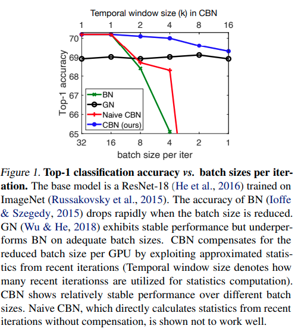
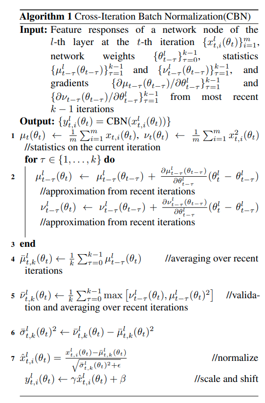

pdf_source: https://arxiv.org/pdf/2002.05712v1.pdf
code_source: https://github.com/Howal/Cross-iterationBatchNorm
time:20200217
short_title:Cross-iteration BatchNormalization
# Cross-Iteration Batch Normalization

这篇文章引入了一个新的模块，称为跨迭代的batchnorm, 这个模块的源码在其github项目的 ./mmdet/models/utils/CBN.py 找得到.

## Motivation 

BatchNormalization的一个问题就是在batchsize比较小的时候效果比较差. 后来发明了[SyncBatchnorm]来进行跨GPU的batchnorm计算。本文进一步提出，使用多次迭代的结果帮助batchnorm。

直觉上来说,尽管由于网络权重变化速度不快，但是相邻的迭代过程中，expected mean and variance还是在变化的。本文借助一些低阶近似，对权重变化做了简要的分析，给出了CBN模块。

## CBN Algorithm

本质上来说，batch response的均值，平方和以及方差等数据值是关于权重的一个deterministic函数，
在实际计算中由某次迭代得到的结果进行Monte-Carlo仿真得到一个参考值。过去得到的均值参考值与当前值差值在这里用泰勒公式近似得到.而这个weight 代码的实现是寻找BN前紧跟着的Conv的weight(无bias)作为这个算法中的$\theta$

$$
\begin{aligned}
\mu_{t-\tau}\left(\theta_{t}\right)=& \mu_{t-\tau}\left(\theta_{t-\tau}\right)+\frac{\partial \mu_{t-\tau}\left(\theta_{t-\tau}\right)}{\partial \theta_{t-\tau}}\left(\theta_{t}-\theta_{t-\tau}\right) \\
&+\mathbf{O}\left(\left\|\theta_{t}-\theta_{t-\tau}\right\|^{2}\right) \\
\nu_{t-\tau}\left(\theta_{t}\right)=& \nu_{t-\tau}\left(\theta_{t-\tau}\right)+\frac{\partial \nu_{t-\tau}\left(\theta_{t-\tau}\right)}{\partial \theta_{t-\tau}}\left(\theta_{t}-\theta_{t-\tau}\right) \\
&+\mathbf{O}\left(\left\|\theta_{t}-\theta_{t-\tau}\right\|^{2}\right)
\end{aligned}
$$
省略高阶项，同时作者指出，不同normalization层之间因为前一层权重变化引起的后一层的均值与方差变化是有限的。这个原因来说，作者的理解是这个Batchnorm中直接学习的 scale and shift对后一层均值与方差的影响总体来说是更为显著的。进而得到这个公式
$$
\begin{array}{l}
{\boldsymbol{\mu}_{t-\tau}^{l}\left(\theta_{t}\right) \approx \mu_{t-\tau}^{l}\left(\theta_{t-\tau}\right)+\frac{\partial \mu_{t-\tau}^{l}\left(\theta_{t-\tau}\right)}{\partial \theta_{t-\tau}^{l}}\left(\theta_{t}^{l}-\theta_{t-\tau}^{l}\right)} \\
{\nu_{t-\tau}^{l}\left(\theta_{t}\right) \approx \nu_{t-\tau}^{l}\left(\theta_{t-\tau}\right)+\frac{\partial \nu_{t-\tau}^{l}\left(\theta_{t-\tau}\right)}{\partial \theta_{t-\tau}^{l}}\left(\theta_{t}^{l}-\theta_{t-\tau}^{l}\right)}
\end{array}
$$

本文后面给出了一个efficient的梯度算法，但是代码里直接使用的是torch.autograd.grad的API。

[SyncBatchnorm]:https://github.com/vacancy/Synchronized-BatchNorm-PyTorch