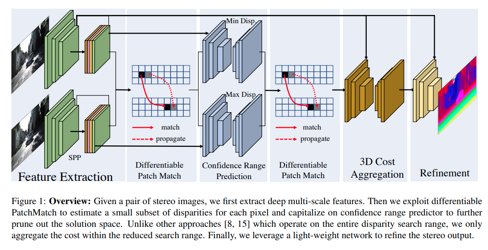

time: 20200228
pdf_source: https://arxiv.org/pdf/1909.05845.pdf
code_source: https://github.com/uber-research/DeepPruner
short_title: Deep Pruner & Differentiable Patch Match

# DeepPruner: Learning Efficient Stereo Matching via Differentiable PatchMatch

不同于使用Cost Volomn密集预测disparity，这篇论文使用Differentiable Patch Match进行一个粗略的disparity估计，最终使得需要densely predict的disparity值远远比之前少。所以称之为pruning。作者称实现了实时的Scencflow估计

## Architecture

1. 特征提取部分使用类似于[PSMNet]的结构
2. Patch Match在[后文](##patch-match)
3. Cost Aggregation与[PSMNet]一致，不过由于经过了pruning, 搜索范围更小
4. Refinement, 使用左图的image-feature通过Conv2D后与Cost Softmax求expectation后的图片residual链接

## Patch Match

Patch Match在本文的官方开源仓库里面可以被理解为是一个单独的大模块。

设计三个主要网络层：

### Sampler Layer
 随机抽样层，在图片上的每个点里面， 在当前搜索窗口内，生成$k$个x方向的扰动值与$k$个y方向的扰动值，最后形成在图片的每一个feature位置上，产生$k*k$个disparity estimation。
### Propagation Layer
 传播层，这里有两个版本，返回值中，每一个feature map上点的特征包含了当前位置的disparity estimation以及相邻位置的disparity estimation. 使用基础版本的话，作者使用了一个预设的Conv3D,去提取紧邻上下左右的feature。 使用快速版本的话作者分两次propagate & evaluate, 分别对水平方向与竖直方向分开处理。
### Evaluation Layer
 评价层， 将右图特征根据randomly select的disparity estimation warp到左图上。然后由于在传播层的时候就已经将相邻的特征都聚集起来了，在评价层对每一个pixel计算左右图相邻特征的相似度。最后使用Softmax 求出各个disparity estimation的概率，并计算其expectation.

### 全局算法
迭代处理，sampler layer-> propagation layer-> evaluation layer.

从全局平均采样开始，在之后的每次迭代中，使用evaluation layer估计的expectation附近一定大小的窗口作为新的采样范围。最终每一个点的采样范围就被进一步地缩小。

[PSMNet]:../other_categories/others/PSMNet.md