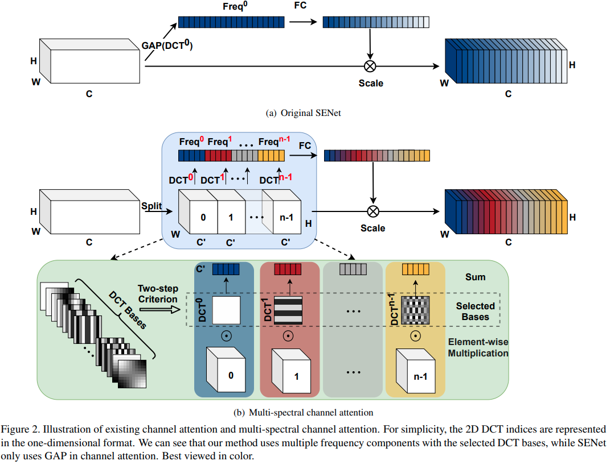
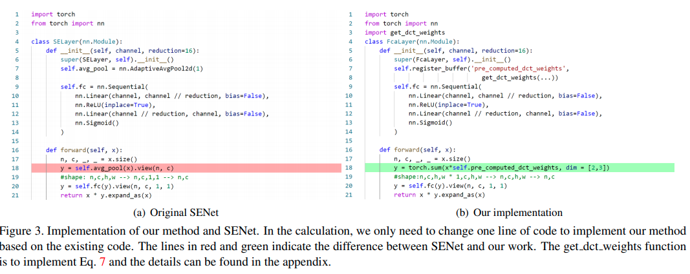

time: 20210126
pdf_source: https://arxiv.org/pdf/2012.11879.pdf

# FcaNet: Frequency Channel Attention Networks

这篇paper是基于[SENet]以及[CBAM]的关于频道上的注意力分配的模块设计。

在[SENet]中SE模块将特征图做一个global average pooling，得到的特征矢量。特征矢量再通过全连接层映射到注意力矢量:

$$
    \text{att} = \text{sigmoid} (\text{fc}( \text{GAP}(X)))
$$

[CBAM]则同时使用max-pooling以及mean-pooling.

本文指出，它们，尤其是[SENet]，从频域上看仅使用了信息中最低频的一簇，因而信息流失比较大。本文的思路是增加使用不同频域的信息.

## 2D DCT

在图片域上， DCT的频域计算:
$$
\begin{array}{l}
f_{h, w}^{2 d}=\sum_{i=0}^{H-1} \sum_{j=0}^{W-1} x_{i, j}^{2 d} \underbrace{\cos \left(\frac{\pi h}{H}\left(i+\frac{1}{2}\right)\right) \cos \left(\frac{\pi w}{W}\left(j+\frac{1}{2}\right)\right)}_{\text {DCT weights }} \\
\text { s.t. } h \in\{0,1, \cdots, H-1\}, w \in\{0,1, \cdots, W-1\}
\end{array}
$$

逆变换:
$$
\begin{array}{l}
x_{i, j}^{2 d}=\sum_{h=0}^{H-1} \sum_{w=0}^{W-1} f_{h, w}^{2 d} \underbrace{\cos \left(\frac{\pi h}{H}\left(i+\frac{1}{2}\right)\right) \cos \left(\frac{\pi w}{W}\left(j+\frac{1}{2}\right)\right)}_{\text {DCT weights }}, \\
\text { s.t. } i \in\{0,1, \cdots, H-1\}, j \in\{0,1, \cdots, W-1\} .
\end{array}
$$

显然，全局平均池化是2D DCT的一个特殊case,

## FCA Net:

算法:

1. 设定$K$个基频，计算比例常数 $B_{h,w}^{i,j} = \cos(\frac{\pi h}{H} (i + \frac{1}{2})) \cos(\frac{\pi w}{W}(j+\frac{1}{2}))$
2. 将输入$X$沿着channel方向分为$[X^0, X^1, ..., X^{n-1}]$. 
3. 对不同部分计算2D DCT: 
$$
\begin{aligned}
\text { Freq }^{i} &=2 \mathrm{DDCT}^{u, v}\left(X^{i}\right) \\
&=\sum_{h=0}^{H-1} \sum_{w=0}^{W-1} X_{:, h, w}^{i} B_{h, w}^{u, v} \\
& \text { s.t. } i \in\{0,1, \cdots, n-1\},
\end{aligned}
$$
4. concat起来并且执行全连接以及 sigmoid.

代码上，除了计算DCT的常数之外，运行时代码变动不大.

[SENet]:Squeeze-and-Excitation_Networks.md
[CBAM]:CBAM:Convolutional_Block_Attention_Module.md