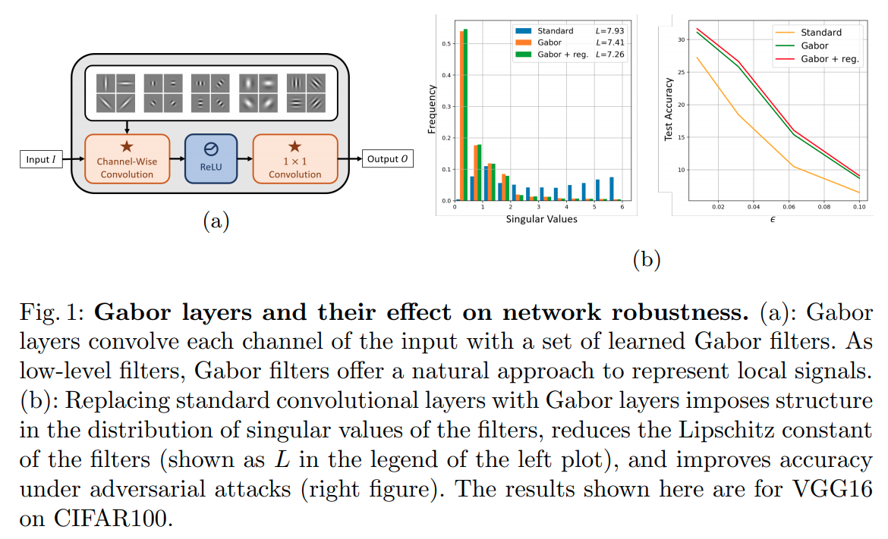
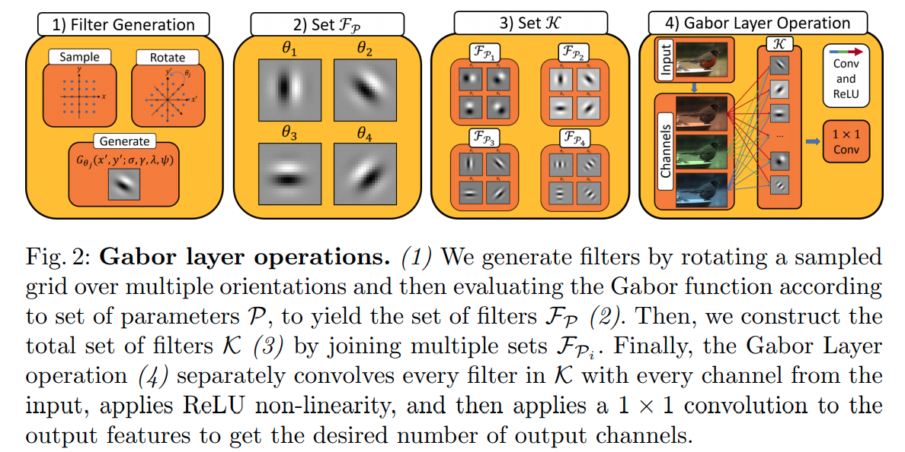

time: 20200828
pdf_source: https://arxiv.org/pdf/1912.05661.pdf
code_source: https://github.com/BCV-Uniandes/Gabor_Layers_for_Robustness
short_title: Gabor Layers

# Gabor Layers Enhance Network Robustness

这篇paper提出将gabor filter 用于替代卷积层.能得到更鲁邦更丰富的features.



## [Gabor Filter](https://www.wikiwand.com/en/Gabor_filter#:~:text=In%20image%20processing%2C%20a%20Gabor,point%20or%20region%20of%20analysis)

Gabor Filter 是一个仿生地线性滤波器,可以理解为一个被高斯调制过的正弦函数. 有一个比较好的[medium教程](https://medium.com/@anuj_shah/through-the-eyes-of-gabor-filter-17d1fdb3ac97)


$$\begin{array}{c}
G_{\theta}\left(x^{\prime}, y^{\prime} ; \sigma, \gamma, \lambda, \psi\right):=e^{-\sigma^{2}\left(x^{\prime 2}+\gamma^{2} y^{\prime 2}\right)} \cos \left(\lambda x^{\prime}+\psi\right) \\
x^{\prime}=x \cos \theta-y \sin \theta \quad y^{\prime}=x \sin \theta+y \cos \theta
\end{array}$$

- $\sigma$:高斯方差
- $\gamma$:spatial aspect ratio
- $\theta$:平行条纹的法向
- $\psi$:相位
- $\lambda$: 正弦波长

## Gabor Layer



上文中的提到的五个参数除了$\theta$皆为系统可直接学习参数。$\theta$在$(0, 2\pi)$间均匀采样的角度.

实现上，由depth-wise gabor filter convolution 与 普通 $1\times 1$ conv组成

### Regularization

作者把前向函数[Lipschitz连续性](../The_theory/Why_gradien_clip_norm.md)与robustness联系起来，而gabor filter的lipschitz常数为:

$$L=\left(1+\left|X^{\prime}\right| e^{-\sigma^{2} m_{*}^{2}}\right)\left(1+\left|Y^{\prime}\right| e^{-\sigma^{2} \gamma^{2} n_{*}^{2}}\right)$$

在损失函数上的修改为:

$$\mathcal{L}=\mathcal{L}_{\mathrm{ce}}-\beta \sum_{i} \sigma_{i}^{2}$$


## [代码实现](https://github.com/BCV-Uniandes/Gabor_Layers_for_Robustness/blob/master/models/gabor_layers.py)

```python
import torch
import numpy as np
import torch.nn as nn
import torch.nn.functional as F

class GaborLayer(nn.Module):
    def __init__(self, in_channels, out_channels, kernel_size, stride, padding, 
        kernels, extra_kernels=0, orientations=8, bias1=False, 
        bias2=False, relu=True, use_alphas=True):
        super(GaborLayer, self).__init__()
        self.in_channels = in_channels
        self.out_channels = out_channels
        self.stride = stride
        self.padding = padding
        self.kernels = kernels
        self.orientations = orientations
        self.extra_kernels = extra_kernels
        self.total_kernels = self.kernels + self.extra_kernels
        self.responses = self.kernels * self.orientations + self.extra_kernels
        self.kernel_size = kernel_size
        self.relu = relu
        self.use_alphas = use_alphas
        # Replicate parameters so that broadcasting is possible
        self.Lambdas = nn.Parameter(torch.randn(self.total_kernels).unsqueeze(
            dim=1).unsqueeze(dim=2).unsqueeze(dim=3))
        self.psis = nn.Parameter(torch.randn(self.total_kernels).unsqueeze(
            dim=1).unsqueeze(dim=2).unsqueeze(dim=3))
        self.sigmas = nn.Parameter(torch.randn(self.total_kernels).unsqueeze(
            dim=1).unsqueeze(dim=2).unsqueeze(dim=3))
        self.gammas_y = nn.Parameter(torch.randn(self.total_kernels).unsqueeze(
            dim=1).unsqueeze(dim=2).unsqueeze(dim=3))

        if self.use_alphas:
            self.alphas = nn.Parameter(torch.randn(self.responses).unsqueeze(
                dim=1).unsqueeze(dim=2))
        # Bias parameters start in zeros
        self.bias = nn.Parameter(torch.zeros(self.responses)) if bias1 else None
        # # # # # # # # # # # # # # The meshgrids
        # The orientations (NOT learnt!)
        thetas = torch.arange(0., self.orientations) * 2 * np.pi / self.orientations
        self.thetas = nn.Parameter(thetas, requires_grad=False)
        # The original meshgrid
        # Bounding box
        xmin, xmax = -1, 1
        ymin, ymax = -1, 1
        x_space = torch.linspace(xmin, xmax, kernel_size)
        y_space = torch.linspace(ymin, ymax, kernel_size)
        (y, x) = torch.meshgrid(y_space, x_space)
        # Unsqueeze for all orientations
        x, y = x.unsqueeze(dim=0), y.unsqueeze(dim=0)
        # Cosines and sines
        cosines = torch.cos(self.thetas).unsqueeze(dim=1).unsqueeze(dim=1)
        sines = torch.sin(self.thetas).unsqueeze(dim=1).unsqueeze(dim=1)
        self.x = x * cosines - y * sines
        self.y = x * sines + y * cosines
        # Expand for the number of kernels
        self.x, self.y = self.x.unsqueeze(dim=0), self.y.unsqueeze(dim=0)
        # Add as parameters
        self.x = nn.Parameter(self.x, requires_grad=False)
        self.y = nn.Parameter(self.y, requires_grad=False)
        # Some precomputed values
        self.x_sq = nn.Parameter(self.x**2, requires_grad=False)
        self.y_sq = nn.Parameter(self.y**2, requires_grad=False)
        # Conv1x1 channels
        self.channels1x1 = self.responses * self.in_channels
        self.conv1x1 = nn.Conv2d(
            in_channels=self.channels1x1, out_channels=out_channels, 
            kernel_size=1, bias=bias2)

    def forward(self, x):
        # Generate the Gabor kernels
        if not hasattr(self, 'gabor_kernels'):
            self.gabor_kernels = self.generate_gabor_kernels()

        if self.training:
            self.gabor_kernels = self.generate_gabor_kernels()
        # kernels are of shape 
        # [self.kernels*self.orientations + self.extra_kernels, 1, self.kernel_size, self.kernel_size]
        # Reshape the input: x is of size
        # [batch_size, in_channels, H, W]
        # and we need to merge the batch size and the input channels for the
        # depthwise convolution (and include a '1' channel for the convolution)
        bs, _, H, W = x.size()
        x = x.view(bs*self.in_channels, H, W).unsqueeze(dim=1)
        # Perform convolution
        out = F.conv2d(input=x, weight=self.gabor_kernels, bias=self.bias, 
            stride=self.stride, padding=self.padding)
        if self.relu:
            out = torch.relu(out)
        # 'out' is of size [batch_size*in_channels, newH, newW]
        _, _, newH, newW = out.size()
        # reshape to:
        out = out.view(bs, self.in_channels, self.responses, newH, newW)
        # now reshape to 
        out = out.view(bs, self.channels1x1, newH, newW)
        return self.conv1x1(out)

    '''
    Inspired by
    https://en.wikipedia.org/wiki/Gabor_filter
    '''
    def generate_gabor_kernels(self):
        # Precompute some squared terms
        gammas_y_sq = self.gammas_y**2
        sigmas_sq = self.sigmas**2

        # ORIENTED KERNELS
        # Compute Gaussian term
        # gaussian_term = torch.exp(-.5 * ( (gamma_x**2 * x_t**2 + gamma_y**2 * y_t**2)/ sigma**2 ))
        ori_y_term = gammas_y_sq[:self.kernels] * self.y_sq
        exponent_ori = (self.x_sq + ori_y_term) * sigmas_sq[:self.kernels]
        gaussian_term_ori = torch.exp(-exponent_ori)
        # Compute Cosine term
        # cosine_term = torch.cos(2 * np.pi * x_t / Lambda + psi)
        cosine_term_ori = torch.cos(self.x * self.Lambdas[:self.kernels] + self.psis[:self.kernels])
        # 'ori_gb' has shape [self.kernels, self.orientations, kernel_size, kernel_size]
        ori_gb = gaussian_term_ori * cosine_term_ori
        # Combine the first two dimensions
        ori_gb = ori_gb.view(self.kernels * self.orientations, self.kernel_size, self.kernel_size)
        if self.extra_kernels > 0:
            # NON-ORIENTED KERNELS (take the first channel of x and y)
            # Compute Gaussian term
            # gaussian_term = torch.exp(-.5 * ( (gamma_x**2 * x_t**2 + gamma_y**2 * y_t**2)/ sigma**2 ))
            y_term = gammas_y_sq[self.kernels:] * self.y_sq[:, :1]
            exponent = (self.x_sq[:, :1] + y_term) * sigmas_sq[self.kernels:]
            gaussian_term = torch.exp(-exponent)
            # Compute Cosine term
            # cosine_term = torch.cos(2 * np.pi * x_t / Lambda + psi)
            cosine_term = torch.cos(self.x[:, :1] * self.Lambdas[self.kernels:] + self.psis[self.kernels:])
            # 'gb' has shape [self.extra_kernels, 1, kernel_size, kernel_size]
            gb = gaussian_term * cosine_term
            # Collapse singleton dimension
            gb = gb.squeeze(dim=1)
            # Join oriented and non-oriented filters
            ori_gb = torch.cat([ori_gb, gb], dim=0)
        if self.use_alphas:
            ori_gb = self.alphas * ori_gb
        return ori_gb.unsqueeze(dim=1)
```