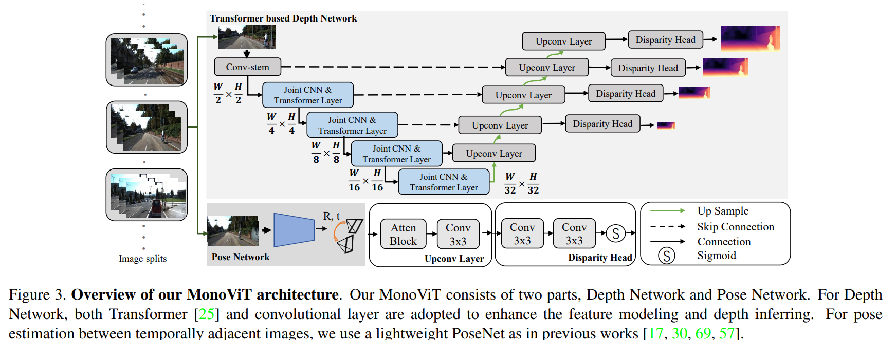
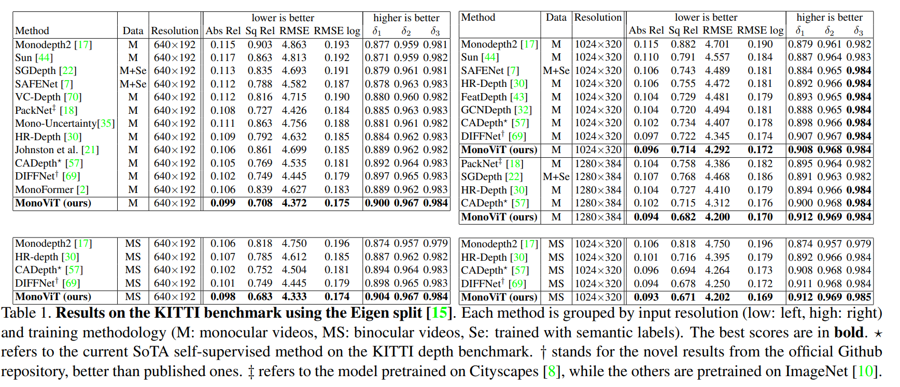
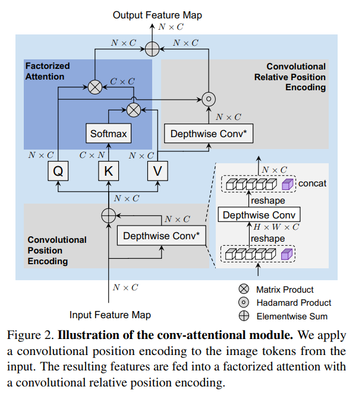
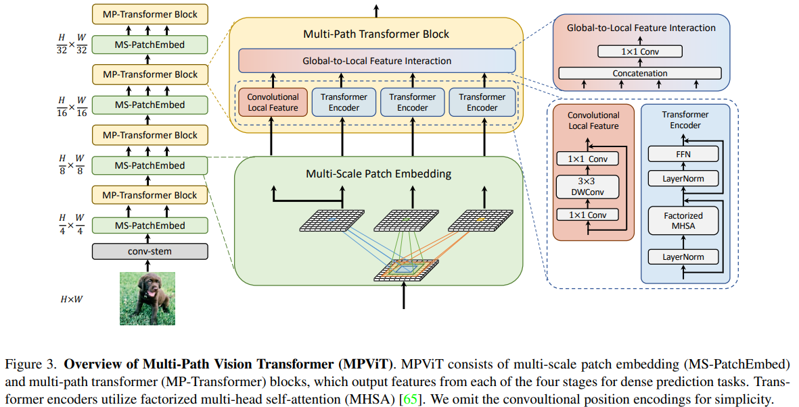
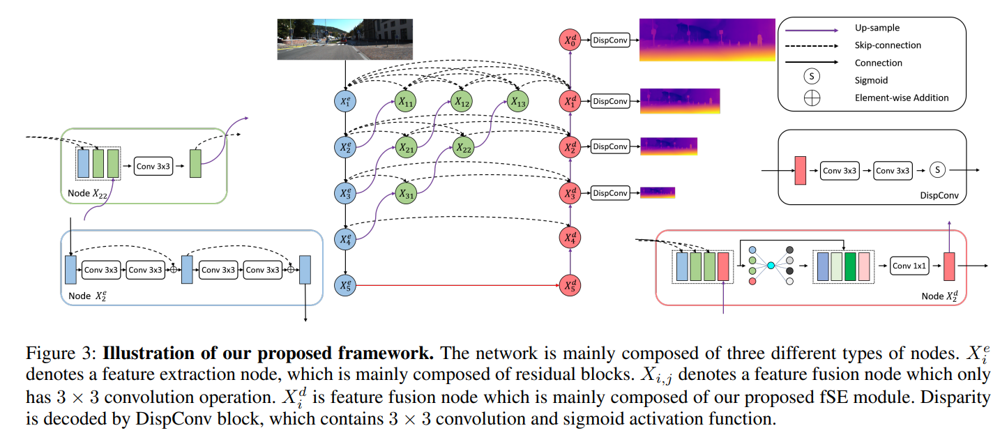

time: 20220811
pdf_source: https://arxiv.org/abs/2208.03543
code_source: https://github.com/zxcqlf/MonoViT
short_title: MonoViT

# MonoViT: Self-Supervised Monocular Depth Estimation with a Vision Transformer

这篇paper尝试用vision transformer 作为backbone输出monodepth. 

核心的这个backbone的改进需要关注 MPViT 以及 CoaT. Decoder采用的时 HR-Depth的decoder.

## Co-Scale Conv-Attentional Image Transformers

[pdf](https://arxiv.org/pdf/2104.06399.pdf) [code](https://github.com/mlpc-ucsd/CoaT)

[知乎连接](https://zhuanlan.zhihu.com/p/377337551)

### Factorized Attention
attention 原来的核心公式是:

$$
    \text{Att}(X) = \text{softmax}(\frac{QK^T}{\sqrt{C}})V
$$

这里的$QK^T$有着 $\mathbf{O}(N^2C)$的复杂度，对图片的分辨率很大的时候有很大的计算资源消耗，

本文跟随LambdaNets采用

$$
    \text{FactorAtt}(X) = \frac{Q}{\sqrt{C}} (\text{softmax}(K)^T V)
$$
把复杂度变为 $\mathbf{O}(NC^2)$, 在大部分的网络中这个计算量更加可控制。

### Convolutional Positional Encoding

根据前文公式可知，以FactorAtt的公式来说，Q特征图中两个像素上的向量如果数值一样，它们输出的数值就是一样的，和图片中的像素位置以及他们的邻域无关。

一部分的ViT工作会把绝对位置作为embedding 放到token里面，本文的做法是加入relative attention map $EV \in \mathbb{R}^{N\times C}$, $E\in \mathbb{R}^{N\times N}$.

$$
\text{RelFactorAtt}(X) = \frac{Q}{\sqrt{C}}(\text{softmax}(K)^TV) + EV
$$

$E_{ij} = \mathbb{I}(i,j) q_i p_{j-i}$, $\mathbb{I}$ 是一个根据位置的indicator函数，确保只attend to 邻域的部分.这个计算复杂度还是比较大，所以本文的方案是:

$$
\begin{aligned}
\hat{EV} &= Q \circ \text{DepthwiseConv2D(V)}
\end{aligned}
$$

这里对不同的head分组采用三个不同的卷积核 (3,5,7), 结果concat 回去输出。

注意MonoViT中没有使用class token. 实际有一定的区别。

## MPViT : Multi-Path Vision Transformer for Dense Prediction

[pdf](https://arxiv.org/abs/2112.11010) [code](https://github.com/youngwanLEE/MPViT)

[知乎连接](https://zhuanlan.zhihu.com/p/478325208)

这篇paper则以 多尺度融合为重点

在不同的scale尺度上，用DepthWiseConv在patch embedding模块进行下采样，并用不同的卷积深度得到不同的基础特征，然后输入到一个MHCABlock中，其中一条路的分支使用一个 inverseResNet (conv1x1_bn_act+dwconv3x3_bn_act_conv1x1_bn)残差链接，作为Local Feature, 然后每个不同感受野的特征分别进入并行的序列Transformer, 这里采用的就是前文提到的factorized attention; with shared  卷积位置embedding 和 shared 卷积相对位置embedding. 在MonoVit不使用cls token的时候，核心就是dwconv。

几个分支中分别计算后，concat起来用conv1x1压缩到目标特征数作为当前尺度的特征输出。

## High Resolution Self-Supervised Monocular Depth Estimation
[pdf](https://arxiv.org/abs/2012.07356) [code](https://github.com/shawLyu/HR-Depth)

这篇paper 借助HRNet相关的研究，提出了上图的decoder模式，并且提出了 feature fusion Squeeze-Excitation (fSE) 模块来提升层级融合时的性能，
