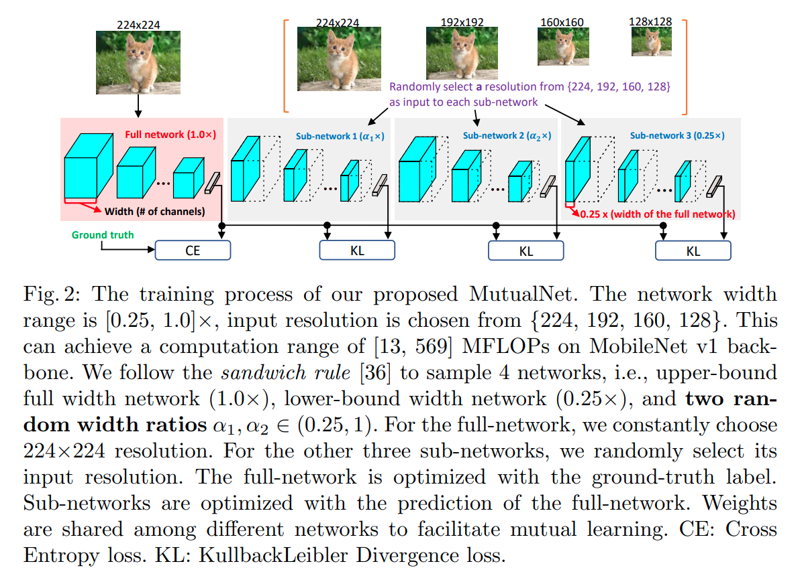
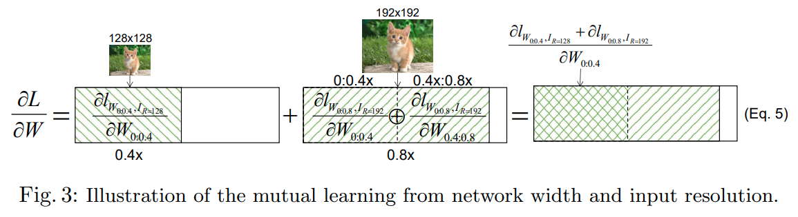

time: 20200705
pdf_source: https://arxiv.org/pdf/1909.12978.pdf
code_source: https://github.com/taoyang1122/MutualNet
short_title: MutualNet
# MutualNet: Adaptive ConvNet via Mutual Learning from Network Width and Resolution

这篇paper基于[EfficientNet](EfficientNet:_Rethinking_Model_Scaling_for_Convolutional_Neural_Network.md)的思路，在此之上继续发散。EfficientNet提出input scale与网络的大小要一同Scale up.

## Methods

### Sandwich Rule

中间两个网络的输入需要是在 $0.25 \times, 1.0\times$之间选取输入大小。

### Inplace Distillation

中间的网络使用的权重都是一致的，在训练过程中最大层作为Teacher network,中间层作为Student network,使用KL Divergence作训练。

### Post-statistics of BN

在训练并确定了选择的输入尺度之后，需要重新为subnetwork收集BN数据。

### Mutual Learning of different resolution

梯度阐述:

$$\begin{aligned}
\frac{\partial L}{\partial W} &=\frac{\partial l_{W_{0: 0.4}, I_{R=128}}}{\partial W_{0: 0.4}}+\frac{\partial l_{W_{0: 0.8}, I_{R=192}}}{\partial W_{0: 0.8}} \\
&=\frac{\partial l_{W_{0: 0.4}, I_{R=128}}}{\partial W_{0: 0.4}}+\left(\frac{\partial l_{W_{0: 0.8}, I_{R=192}}}{\partial W_{0: 0.4}} \oplus \frac{\partial l_{W_{0: 0.8}, I_{R=192}}}{\partial W_{0.4: 0.8}}\right) \\
&=\frac{\partial l_{W_{0: 0.4}, I_{R=128}+\partial l_{W_{0: 0.8}, I_{R=192}}} \oplus \frac{\partial l_{W_{0: 0.8}, I_{R=192}}}{\partial W_{0: 0.4}}}{\partial W_{0.4: 0.8}}
\end{aligned}$$

