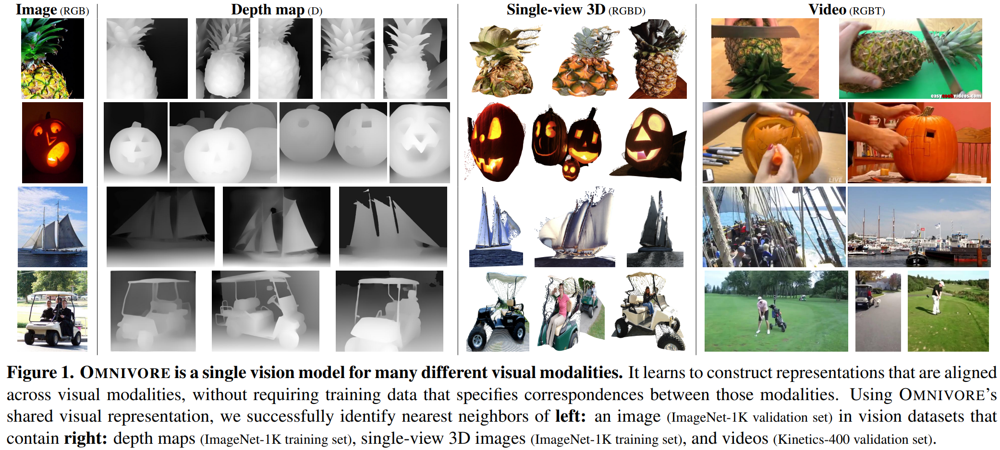
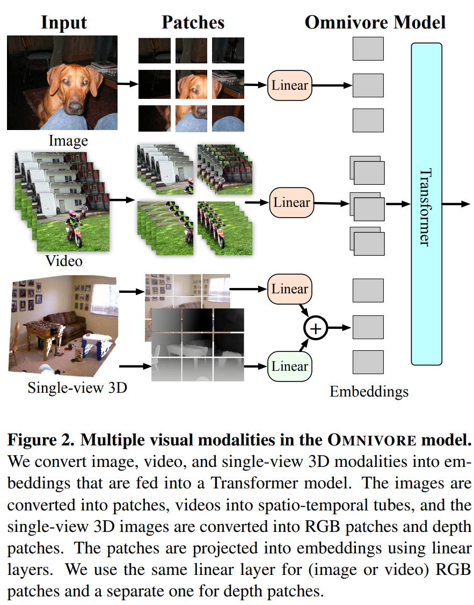

code_source: https://github.com/facebookresearch/omnivore
pdf_source: https://arxiv.org/pdf/2201.08377.pdf
time: 20220124

# OMNIVORE: A Single Model for Many Visual Modalities

这篇论文介绍了Omnvore模型，基本是基于[Swin Transformer](swinV2.md)的复合模态输入模型。

上图寻找不同数据集中ImageNet里的Nearest neighbour.

实际做法上是用同一个模型，直接使用不同的模态进行训练。只是需要不同的patch stem适应不同的输入方案。中间的Swin Model与图片大小以及视频长度关系不大。

同时跨数据模型，由于增加了预训练以及训练的数据摄入量，在RGBD以及视频数据集中表现出更好的性能。