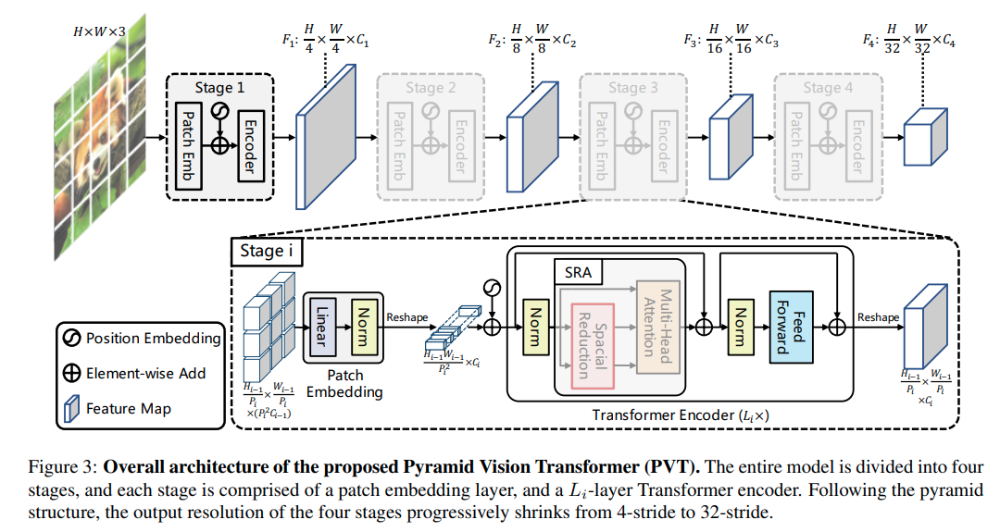
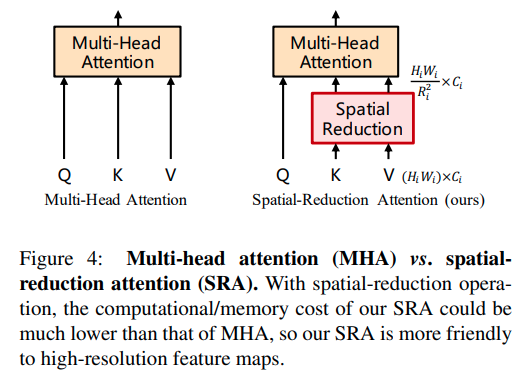

time: 20210517
pdf_source:https://arxiv.org/pdf/2102.12122.pdf
code_source:https://github.com/whai362/PVT
# Pyramid Vision Transformer: A Versatile Backbone for Dense Prediction without Convolutions

这篇paper给出了一个在高分辨率时仍能运行的transformer的backbone,并且能输出dense head.

在stage $i$, 特征图会变成 $\frac{H_{i-1}W_{i-1}}{P_i^2}$个patches

对于高分辨率的图，可以采用如图的方式，spatially reduce key和value的维度，以控制在高分辨率时的维度.

