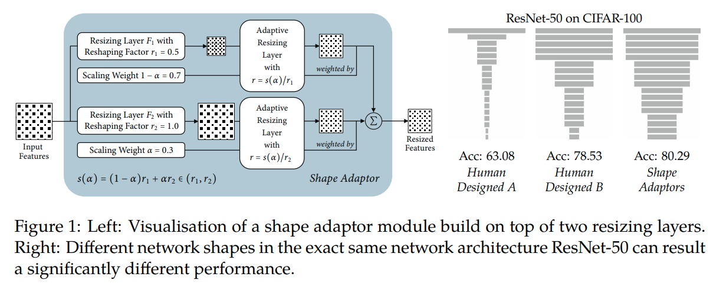

time: 20200809
pdf_source: https://arxiv.org/pdf/2008.00892v1.pdf
code_source: https://github.com/lorenmt/shape-adaptor
short_title: Shape Adaptor

# Shape Adaptor: A Learnable Resizing Module




```python
def ShapeAdaptor(input1, input2, alpha, residual=False, r1=0.5, r2=1.0):
    # sigmoid_alpha = sigmoid(alpha) if having penalty, i.e. penalty = 1;
    # the penalty value will be defined/computed in the model_training file
    sigmoid_alpha = torch.sigmoid(alpha) * ShapeAdaptor.penalty + r1 / (r2 - r1) * (ShapeAdaptor.penalty - 1)
    s_alpha = (r2 - r1) * sigmoid_alpha.item() + r1

    # total no. of shape adaptors
    ShapeAdaptor.counter += 1

    # the true current dim without any penalty (will be used for computing the correct penalty value)
    ShapeAdaptor.current_dim_true *= ((r2 - r1) * torch.sigmoid(alpha).item() + r1)

    if ShapeAdaptor.type == 'local':
        # a shape adaptor will drop at least 1 dimension (local structure), used in standard or AutoTL mode
        ShapeAdaptor.current_dim = int(ShapeAdaptor.current_dim * s_alpha)
        dim = 1 if ShapeAdaptor.current_dim < 1 else ShapeAdaptor.current_dim   # output dim should be at least 1

    elif ShapeAdaptor.type == 'global':
        # a shape adaptor could maintain the same dimension (global structure), used in AutoSC mode
        ShapeAdaptor.current_dim = ShapeAdaptor.current_dim * s_alpha
        dim = 1 if ShapeAdaptor.current_dim < 1 else round(ShapeAdaptor.current_dim)  # output dim should be at least 1

    '''
    input1 = resizing(x, scale=r1);  input2 = resizing(x, scale=r2)
    It's important to debug/confirm your model design using these two different implementations.
    Implementation A:
    input2_rs = F.interpolate(input2, scale_factor=(1/r2)*s_alpha, mode='bilinear', align_corners=True)
    input1_rs = F.interpolate(input1, size=input2_rs.shape[-2:], mode='bilinear', align_corners=True)
    Implementation B:
    input1_rs = F.interpolate(input1, scale_factor=(1/r1)*s_alpha, mode='bilinear', align_corners=True)
    input2_rs = F.interpolate(input2, size=input1_rs.shape[-2:], mode='bilinear', align_corners=True)
    Those two implementations (along with an additional version below) should produce the same shape.
    Note: +- 1 dim change in intermediate layers is expected due to different rounding methods.
    '''

    input1_rs = F.interpolate(input1, size=dim, mode='bilinear', align_corners=True)
    input2_rs = F.interpolate(input2, size=dim, mode='bilinear', align_corners=True)
    if residual:  # to keep gradient magnitude consistent with standard residuals: f(x) + x
        return 2 * (1 - sigmoid_alpha) * input1_rs + 2 * sigmoid_alpha * input2_rs
    else:
        return (1 - sigmoid_alpha) * input1_rs + sigmoid_alpha * input2_rs
```