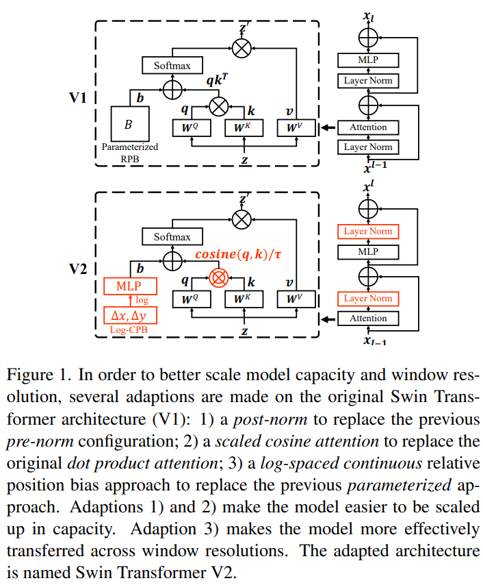

time: 20211206
pdf_source: https://arxiv.org/abs/2111.09883
code_source: https://github.com/microsoft/Swin-Transformer

# Swin Transformer V2: Scaling Up Capacity and Resolution

这篇paper把swin transformer尺度进行了提升。并且使用了多个trick提升transformer block的性能。

在把swin transformer从图片分类转到下游任务时，常常需要提升分辨率。提升分辨率时，主要遇到的问题：

- 模型提升分辨率时原有模型的性能可能会退化。
- swin-transformer的很多基础操作可能和尺度有相关性。需要更可靠的转移手段，提升模型迁移时的效果。

本文提出了一系列的技巧，减少了GPU存储的使用，使得模型在更大的分辨率时可训练。并提升了预训练效果。

## Basic Review of Swin Transformer

首先回顾一下 [Swin](../other_categories/Summaries/SelfAttentionandCNN.md). 

- Normalization是在MLP之前的，称为 pre-normalization.
- Position Bias采用的是relative position bias. 原来的方案是加入一个 $B\in R^{M^2 \times M^2}$的矩阵，使得attention的输出为 $\text{Attention}(Q, K, V) = \text{SoftMax}(QK^T / \sqrt{d} + B)V$

把模型输入提升的时候发现的问题。

- 模型的容量提升的过程中结果不稳定。甚至会无法训练。
- 随着window size的变化，模型迁移的时候性能会变差，几乎无法迁移。

### 后归一化 
分析前归一化不能保证输出的稳定性，在残差链接的时候可能会数值不稳定，所以这里提出采用post-normalization. 在MLP之后再进行normalization，这样可以保证累加之后的数值不会太病态。

### Scaled Cosine Attention
原来的Attention模块里面，使用点乘，现在这里使用scaled cosine 来计算两个像素之间的相似性。

$$\text{Sim}(q_i, k_j) = \text{cos}(q_i,k_j)/\tau + B_{i,j}$$

其中$\tau$是可以学习的尺度参数。

### Scaling Window Resolution

引入了log-spaced 连续位置。使得相对位置bias可以跟随着窗口大小进行转移。

与直接优化位置参数不同，本文提出训练一个小的meta网络(两层MLP)学习从相对位置到bias的映射。

$$B(\Delta x, \Delta y) = \mathcal{G}(\Delta x, \Delta y)$$

为了可以延展到更大的窗口，更大的$\Delta x$, 本文提出在计算positional bias的时候不要使用原来的坐标值，而是采用log值。

$$\hat{\Delta x} = \text{sign}(x) \dot \text{log}(1 + |\Delta x|)$$

用这个方法，在拓展到更大的窗口的时候，需要延拓的倍数大大缩小，提升了延展时的稳定性。