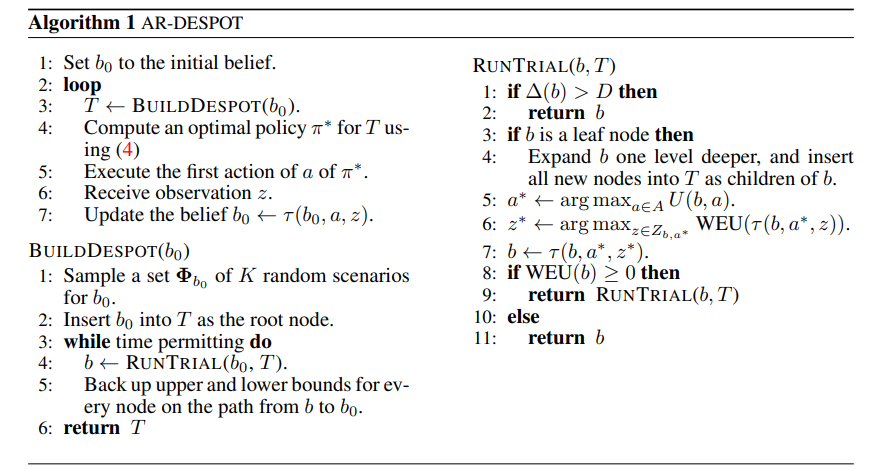

pdf_source: http://www.roboticsproceedings.org/rss15/p06.pdf
short_title: DESPOT-α
# DESPOT-α: Online POMDP Planning With Large State And Observation Spaces

## Under Construction

对这篇文章的理解还没完全，这篇文章有一个重要的[前置](https://papers.nips.cc/paper/5189-despot-online-pomdp-planning-with-regularization.pdf)也没读完。数学难度较高。这里尝试同时写两个文章的review。这两篇文章解答的都是求解POMDP(partially observable markov decision process)的问题，基本思路是蒙特卡洛算法(然而还有大量的数学理论以及分析，目前并未学贯通)

前置论文算法:

