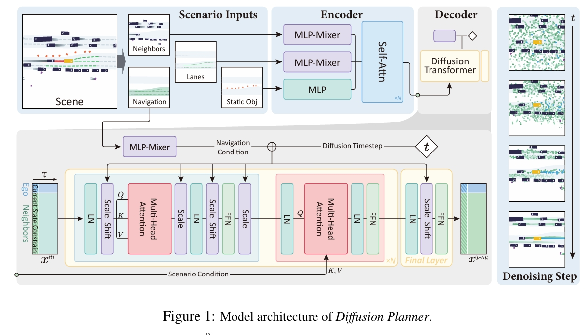

time: 20250502
code_source: https://github.com/ZhengYinan-AIR/Diffusion-Planner
pdf_source: https://arxiv.org/pdf/2501.15564
short_title: Diffusion Planner

# Diffusion-Based Planning for Autonomous Driving with Flexible Guidance

[Project Page](https://zhengyinan-air.github.io/Diffusion-Planner/)

- 使用Diffusion model 生成无人车Planner轨迹
- 二段式End to End形态，输入的不是传感器数据，而是稠密数据

## Diffusion Model Fundamental

前向的加噪过程：
$$
q_{t 0}\left(\boldsymbol{x}^{(t)} \mid \boldsymbol{x}^{(0)}\right)=\mathcal{N}\left(\boldsymbol{x}^{(t)} \mid \alpha_t \boldsymbol{x}^{(0)}, \sigma_t^2 \mathbf{I}\right), t \in[0,1],
$$

反向过程可以用一下的diffusion ODE解
$$
\text { (Diffusion ODE) } \mathrm{d} \boldsymbol{x}^{(t)}=\left[f(t) \boldsymbol{x}^{(t)}-\frac{1}{2} g^2(t) \nabla_{\boldsymbol{x}^{(t)}} \log q_t\left(\boldsymbol{x}^{(t)}\right)\right] \mathrm{d} t,
$$
其中的$f(t), g(t)$与noise的规划$\alpha_t, \sigma_t$相关。
$$
f(t)=\frac{\mathrm{d} \log \alpha_t}{\mathrm{~d} t}, g^2(t)=\frac{\mathrm{d} \sigma_t^2}{\mathrm{~d} t}-2 \frac{\mathrm{~d} \log \alpha_t}{\mathrm{~d} t} \sigma_t^2
$$

Diffusion就是用score网络$s_\theta(x^{(t)}, t)$来拟合$\nabla_{x^{(t)}} \log q_t(x(t))$

### Classifier Guidance
使用一个classifier $\mathcal{E}_\phi(x^{(t)}, t)$, 使用分类score的梯度去修改Diffusion score
$$
\tilde{\boldsymbol{s}}_\theta\left(\boldsymbol{x}^{(t)}, t\right)=\boldsymbol{s}_\theta\left(\boldsymbol{x}^{(t)}, t\right)-\nabla_{\boldsymbol{x}^{(t)}} \mathcal{E}_\phi\left(\boldsymbol{x}^{(t)}, t\right)
$$

## Diffusion Planner Methodology

### Tasks Statement

作者把任务声明为Future Generation Task. 输入条件$C$, 包含当前车辆状态(current vehicle state), 历史数据(historical data), 车道线信息(lane information), 导航信息(navigation information), 输出所有关键参与者的未来轨迹，从而允许对合作者的行为进行建模,

$$
\boldsymbol{x}^{(0)}=\left[\begin{array}{c}
x_{\text {ego }}^{(0)} \\
x_{\text {neighbor }_1}^{(0)} \\
\vdots \\
x_{\text {neighbor }_M}^{(0)}
\end{array}\right]=\left[\begin{array}{cccc}
x_{\text {ego }^1}^1 & x_{\text {ego }_2^2} & \ldots & x_{\text {ego }^\tau} \\
x_{\text {neighbor }_1}^1 & x_{\text {neighbor }_1}^2 & \ldots & x_{\text {neighbor }_1}^\tau \\
\vdots & \vdots & \ddots & \vdots \\
x_{\text {neighbor }_M}^1 & x_{\text {neighbor }_M}^2 & \ldots & x_{\text {neighbor }_M}^\tau
\end{array}\right]
$$

本文使用带有括号的上标表达diffusion的时间步，普通的上标表达轨迹的时间步.

选择附近$M$个最近的车辆，并预测他们可能的未来轨迹，Diffusion Planner的训练目标为

$$
\mathcal{L}_\theta=\mathbb{E}_{\boldsymbol{x}^{(0)}, t \sim \mathbb{U}(0,1), \boldsymbol{x}^{(t)} \sim q_{t 0}\left(\boldsymbol{x}^{(t)} \mid \boldsymbol{x}^{(0)}\right)}\left[\left\|\mu_\theta\left(\boldsymbol{x}^{(t)}, t, \boldsymbol{C}\right)-\boldsymbol{x}^{(0)}\right\|^2\right],
$$

Diffusion Score为$s_\theta = (\alpha_t \mu_\theta - x^{(t)}) / \sigma_t^2$用作denoising.

### Network

- 基于DiT架构，
- 在第一个step, 基础输出为所有车的当前轨迹位置(不包含速度与加速度以提升闭环性能)。
- 使用[MLP-Mixer](https://zhuanlan.zhihu.com/p/369960950)提取并融合多种类别（车辆的位置方向，速度，大小，种类； 车道线的坐标交通灯速度限制）的信息。

