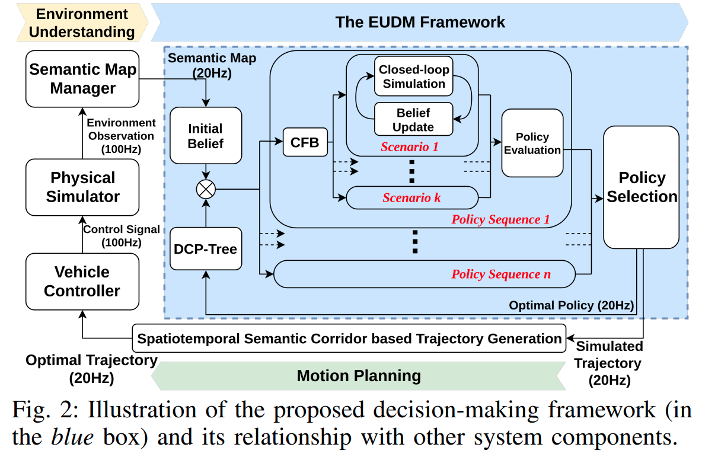

time: 20200803
pdf_source: https://arxiv.org/pdf/2003.02746.pdf
code_source: https://github.com/HKUST-Aerial-Robotics/eudm_planner
short_title: EUDM Planning

# Efficient Uncertainty-aware Decision-making for Automated Driving Using Guided Branching

这篇paper是沈教授组[Wenchao Ding](https://wenchaoding.github.io/) 在车辆意图预测，决策以及路径规划的几个工作之一。该作者在实车上实现了性能较好的demo。

这篇paper基本没有使用学习算法，重点是基于经验的抽象与剪枝，解释性以及扩展性都很强。

## 设计框架

蓝色框部分主要是一个部分可观测的马尔科夫模型(POMDP), 核心单元有三，第一个表征是本体决策序列的DCP-Tree, 第二个是对重点车辆的行为进行穷举的CFB， 第三个是每个被穷举场景的仿真

**Domain-specific Closed-loop Policy Tree (DCP-Tree)**

作者设计了一个8s的planning horizon,每2s为一个policy更新的节点，所以DCP树的深度为4。作者进一步考虑了一个剪枝方法，作者认为每个规划周期中，只会发生一次策略更新，如果需要复杂的规则变化(lane-keep -> lane-change -> lane-keep),则可以通过高频率的重新规划实现。

**Conditional Focused Branching (CFB)**

作者的设计是穷举相关车辆的所有intention， 但是这个"相关"车辆是由本车的决策决定的。比如左转的时候会仅考虑本线以及左侧的车辆，限制了搜索的agent数量。

**内部仿真**

作者在法向方向对其他车辆的控制算法是pure pursuit controller, 沿线方向的控制逻辑为 [IDM](https://www.wikiwand.com/en/Intelligent_driver_model)

