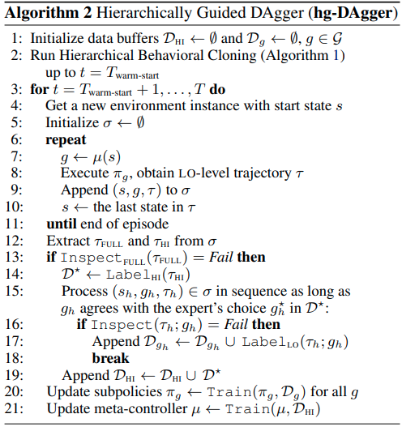
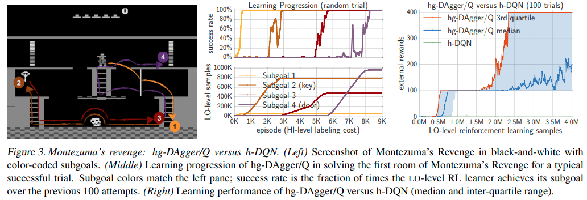

time: 20210430
pdf_source: https://arxiv.org/pdf/1803.00590.pdf
code_source: https://github.com/hoangminhle/hierarchical_IL_RL

# Hierarchical Imitation and Reinforcement Learning

本文[官方主页](https://sites.google.com/view/hierarchical-il-rl)

这篇文章的主要思路是将强化学习层级化。利用专家经验，将任务分解为多个小任务，网络会同时尝试模仿专家在大、小任务上的经验，也会用强化学习增强相关的经验。

## Formalization

对于一个任务，本文会将它分为$H_{HI}$个序列的子任务，以上图的迷宫举例，里面每一个$3x3$的方格块就可以理解为一个子任务。而在$3x3$方格块内一格一格地运动则是理解为子任务的执行。

因为任务就变为了两种

- 高级目标的转移轨迹 $\sigma^* = (s_1^*, g_1^*, \tau_1^* ....)$
- 底层任务的转移轨迹 $\tau^* = (s_1^*, a_1^*, ....)$

蒙特祖玛复仇的任务分解:

