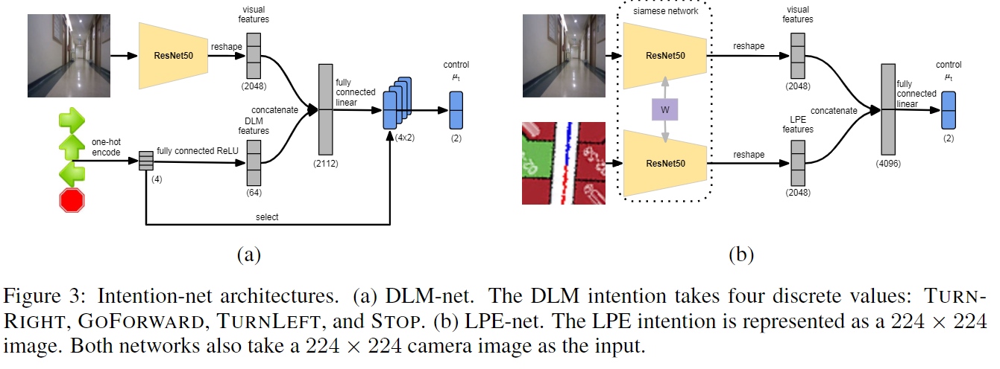

pdf_source: https://arxiv.org/pdf/1710.05627.pdf
short_title: Intention-Net
# Intention-Net: Integrating Planning and DeepLearning for Goal-Directed Autonomous Navigation

这篇论文提出了Intention Net。给出了两种概念以及，一个是DLM(Discrete Local Motion)及其网络，一个是LPE(local path and environment)及其网络

## DLM：离散局部运动

本文的离散局部运动也就是指当前建议（命令）的局部运动，比如说左右转、直行以及停车，论文实现的是通过当前路径的曲率来判定局部运动的。

但是可以由定义看到，这个是一个不完整的描述，比如说前方有多个分岔口时左右转信息并不充分。

## LPE：局部路径与环境

本文的局部路径与环境，用一个224*224的鸟瞰视角的图片，图中包含地图中的障碍物信息(costmap)、最近走过的轨迹、以及将来规划的轨迹

## 网络结构

分别用这两个结构，在接受路径规划的局部路径输入以及地图信息之后输出控制指令，可以端到端学习。