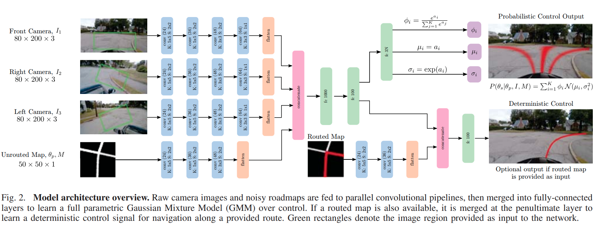

time: 20200513
pdf_source: https://www.ram-lab.com/papers/2020/cai2020raliros.pdf
short_title: PMPNet
# Probabilistic End-to-End Vehicle Navigation in Complex Dynamic Environments with Multimodal Sensor Fusion

这篇paper也是实验室学长的工作. 有[视频](https://www.bilibili.com/video/BV1Yp4y197VV):

<iframe src="//player.bilibili.com/player.html?aid=968062596&bvid=BV1Yp4y197VV&cid=187191383&page=1" scrolling="no" border="0" frameborder="no" framespacing="0" allowfullscreen="true" height=270 width=480> </iframe>

## Network structure

Route来自于CARLA的输入，这里采用最近的130个waypoints(CARLA地图上的小点)。

attention是用于表达不同传感器的特征的权重.$a_1$表达的是模仿学习给出的throttle, steering and brake

GMM的回归使用来自于[这一篇paper.pdf](https://ieeexplore.ieee.org/stamp/stamp.jsp?tp=&arnumber=8793579)。输出的是未来数秒内车子的运动规划值(速度与角度分布图)，对其进行积分得到未来5m的目标位置，用PID控制器跟踪这个目标点得到$a_2$,两个控制指令的融合则是依据对累计方差值的估计。下图来自于这篇引用的论文，具体功能与本文无关：

$$\boldsymbol{a}_{f}=(1-\lambda) \boldsymbol{a}_{1}+\lambda \boldsymbol{a}_{2}, \lambda=e^{-c_{1} \cdot \max \left(0, \Sigma_{i}^{k} \sigma^{2}-c_{2}\right)}$$

融合了GMM模仿学习的思想，利用GMM替代传统planning，给出带方差估计的learning结果，用模仿学习提高性能，配合方差估计给出控制结果。