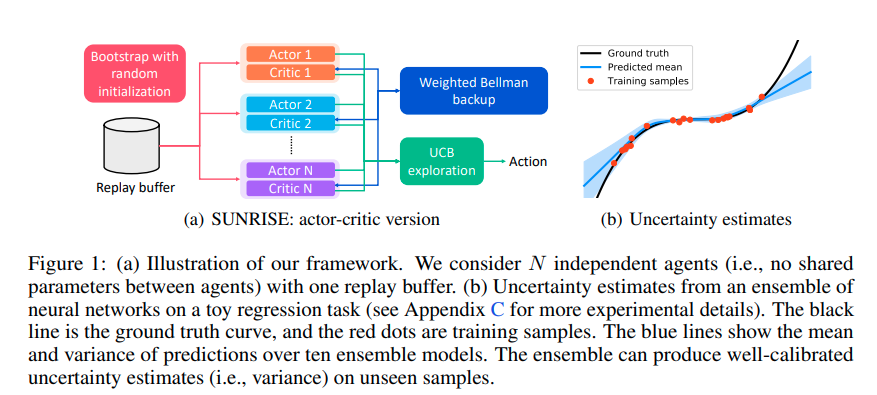
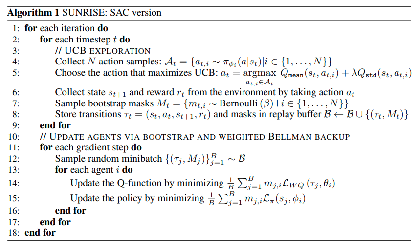

time: 20210204
pdf_source: https://arxiv.org/pdf/2007.04938.pdf
code_source: https://github.com/pokaxpoka/sunrise
short_title: SUNRISE

# SUNRISE: A Simple Unified Framework for Ensemble Learning in Deep Reinforcement Learning

这篇论文是基于SAC的一个扩展算法，有比较好的一个[知乎文章介绍](https://zhuanlan.zhihu.com/p/159307601).

## Preview - SAC

Soft-Actor-Critic (SAC)是一个SOTA的 model-free 连续RL算法. [知乎文章介绍](https://zhuanlan.zhihu.com/p/159413395)

关键的一些特征:

- Off-policy, 使用replay buffer.
- actor 网络输出mean, variance。 重整化采样后，在收集replay buffer的过程中输出的是随机的策略。
- 在最大化奖励的同时最大化策略的熵, Q function的训练损失为: 
$$
\mathcal{L}_{Q}\left(\tau_{t}, \theta\right)=\left(Q_{\theta}\left(s_{t}, a_{t}\right)-r_{t}-\gamma \mathbb{E}_{a_{t+1} \sim \pi_{\phi}}\left[Q_{\bar{\theta}}\left(s_{t+1}, a_{t+1}\right)-\alpha \log \pi_{\phi}\left(a_{t+1} \mid s_{t+1}\right)\right]\right)^{2}
$$
Actor 的训练目标为:
$$
\mathcal{L}_{\text {actor }}^{\text {SAC }}(\phi)=\mathbb{E}_{s_{t} \sim \mathcal{B}}\left[\mathcal{L}_{\pi}\left(s_{t}, \phi\right)\right], \text { where } \mathcal{L}_{\pi}\left(s_{t}, \phi\right)=\mathbb{E}_{a_{t} \sim \pi_{\phi}}\left[\alpha \log \pi_{\phi}\left(a_{t} \mid s_{t}\right)-Q_{\theta}\left(s_{t}, a_{t}\right)\right]
$$
- double-Q trick. 会训练两个Q网络，actor的训练目标中$Q$取两个Q网络中的最小值。

## Sunrise

在SAC的基础上融合了三个关键点.

- 随机初始化,同时训练$N$个SAC agent($N$个actor 和 critics). 且在采集replay buffer的时候会随机生成一个$N$维的binary mask, 在训练这个样本的时候，根据binary mask选择不同的agent来训练，这个技巧可以保证不同agent的diversity (注意在决定采集的action的时候会综合考虑全部的agent的输出， binary mask只影响这个样本用于训练的时候的效果).
- 带有权重的Bellman更新。 在训练Q函数的时候，对于每一个"target Q"样本输入$(s_{t+1}, a_{t+1})$, 计算一个权重$w(s, a) = \text{sigmoid}(-\bar Q_{\text{std}}(s, a) * T) + 0.5$. 那么用于训练critics的损失函数都乘上这个权重$L_{WQ}(\tau_t, \theta_i) = w(s_{t+1}, a_{t+1}) L_Q(\tau_t, \theta_i)$.
- Upper Confidence Bound(UCB, 置信上限) 探索。在探索并收集replay buffer的时候，寻找$a_t = \underset{a}{\text{max}}\{Q_{\text{mean}(s_t, a)} + \lambda Q_{\text{std}} (s_t, a)\}$. 这个最大化的严谨解是很难求的，本文的近似做法是让$N$个actor生成$N$个action 候选，然后分别在$N$个critics上计算这个$N$个 action的$Q$的均值与方差。

