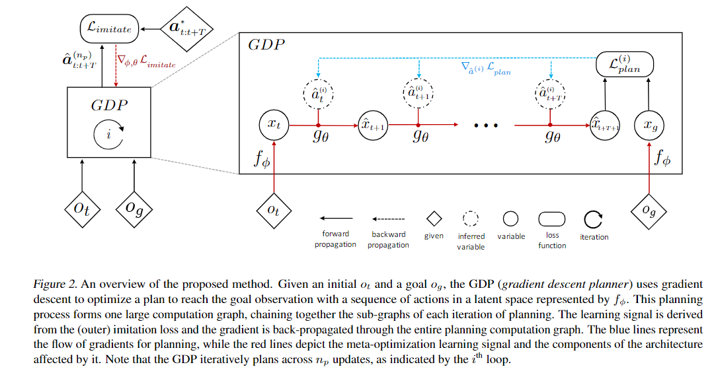

code_source: https://github.com/aravindsrinivas/upn
pdf_source: https://arxiv.org/pdf/1804.00645.pdf
# Universal Planning Networks

这篇论文给出了一个通用的用于planning的网络结构，目的是输出一系列的state以接近goal state。它一方面可以用于planning，也可以根据学习到的参数给出强化学习使用的成本函数

## 主要贡献

### 1. 网络结构与算法

给出当前观测$o_t$以及目标观测$o_g$作为输入图像，$\hat a_t$为$t$时刻预测的行动

在GDP(Gradien Descent Planner)中，用可学习的编码器$f_\phi$将观测$o_t$转换为latent space $x_t$,再用可学习的模型转换参数$\hat x_{t+1} = g_\theta(x_t, a_t)$学习$n_p$步。其中的action $a_t$为随机初始化，其后使用梯度下降进行优化更新。

    个人理解，其实state transition结构可以使用res残差连接更科学。

规划过程中的损失函数$L_{plan}^{(i)}$为最终预测的$x_{t+T+1}$与$x_g$的距离（可导）。

对planner的训练可以用Imitation，因为GDP给出action的算法尽管有梯度的使用，但是是完全可导的。在这个基础上给出相对参考行动的损失函数$L_{imitate} = ||\hat a_{t:T} - a^{*}_{t:t+T}||_2^2$,用梯度更新编码器以及过程网络的参数。

本文进一步介绍了使用这个学习到的编码器与系统模型来辅助强化学习的运动生成。

    个人理解，这个文章的代码难度在于模仿学习的时候，一方面需要用梯度更新运动，另一方面要进一步的用梯度更新系统参数。pytorch以及Tensorflow默认情况下只会记住一次运算过程中的梯度信息，然后在梯度更新的时候需要删除此前记录的所有运算图。但是这里模仿的时候似乎需要我们记住梯度更新的时候使用的整个运算图(也可能只需要最后一步，并保留最后一步的梯度)

