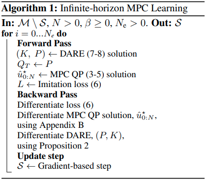

time: 20200427
pdf_source: https://openreview.net/pdf?id=ryxC6kSYPr
short_title: differentiable pre-stablized MPC
# Infinite-Horizon Differentiable Model Predictive Control

这篇paper与[OptNet]有很强的关联性.[OptNet]利用KKT condition对QP问题的推理结果进行反向求导，使得二次规划优化问题的backward阶段不需要被forward阶段的迭代所影响。效率显著提高。

这篇paper则使用了控制领域的一个常见的trick，在使用非线性优化器/复杂算法时，先使用一个可靠的控制器使原来的系统基本稳定，再让额外添加的优化器对残差结果进行回归。

本文使用的预稳定控制器是一个LQR控制器。而LQR中存在有Q，R两个代表各个state与input的损失超参，作者的一个主要贡献就是让这两个损失超参也变成可以被学习的参数，给出了对Riccati方程的导数进行传播的公式。

文章的算法框架如图:

## MPC Review

对于一个线性系统，步长为$N$的MPC控制，可以划归为以下带有松弛变量(slack variables)的二次优化问题.使得问题总是有解的。

$$\begin{aligned}
\hat{u}_{0: N}^{\star}=\underset{\hat{u}}{\operatorname{argmin}} &\frac{1}{2} \sum_{k=0}^{N-1} \hat{u}_{k}^{\top} R \hat{u}_{k}+\frac{1}{2} \sum_{k=1}^{N-1} \hat{x}_{k}^{\top} Q \hat{x}_{k}+\frac{1}{2} \hat{x}_{N}^{\top} Q_{N} \hat{x}_{N}+k_{u} \sum_{k=0}^{N-1} \mathbf{1}_{m}^{\top} r_{k}+k_{x} \sum_{k=1}^{N} \mathbf{1}_{n}^{\top} s_{k} \\
\text { s.t. } &\hat{x}_{0}=x_{t} \\
&\hat{x}_{k+1}=A \hat{x}_{k}+B \hat{u}_{k}, \quad k \in\{0, \ldots, N-1\} \\
&\underline{u}-r_{k} \leq \hat{u}_{k} \leq \bar{u}+r_{k} \quad \text { and } \quad r_{k} \geq 0, \quad k \in\{0, \cdots N-1\} \\
&\underline{x}-s_{k} \leq \hat{x}_{k} \leq \bar{x}+s_{k} \quad \text { and } \quad s_{k} \geq 0, \quad k \in\{1, \ldots, N\}
\end{aligned}$$

如果将输入控制变量分解为$u_t =  Kx_t + \delta u_t$,其中$K$为线性状态反馈矩阵。上述问题变为

$$\begin{aligned}
\delta \hat{u}_{0: N}^{\star}=\underset{\delta \hat{u}}{\operatorname{argmin}} & \frac{1}{2} \sum_{k=0}^{N-1}\left(K \hat{x}_{k}+\delta \hat{u}_{k}\right)^{\top} R\left(K \hat{x}_{k}+\delta \hat{u}_{k}\right)+\frac{1}{2} \sum_{k=1}^{N-1} \hat{x}_{k}^{\top} Q \hat{x}_{k}+\frac{1}{2} \hat{x}_{N}^{\top} Q_{N} \hat{x}_{N} \\
&+k_{u} \sum_{k=0}^{N-1} \mathbf{1}_{m}^{\top} r_{k}+k_{x} \sum_{k=1}^{N} \mathbf{1}_{n}^{\top} s_{k} \\
\text { s.t. } & \hat{x}_{0}=x_{t} \\
&\hat{x}_{k+1}=(A+B K) \hat{x}_{k}+B \delta \hat{u}_{k}, \quad k \in\{0, \ldots, N-1\} \\
& \underline{u}-r_{k} \leq K \hat{x}_{k}+\delta \hat{u}_{k} \leq \bar{u}+r_{k} \quad \text { and } \quad r_{k} \geq 0, \quad k \in\{0, \ldots, N-1\} \\
&\underline{x}-s_{k} \leq \hat{x}_{k} \leq \bar{x}+s_{k} \text { and } \quad s_{k} \geq 0, \quad k \in\{1, \ldots, N\}
\end{aligned}$$

将它们重整为QP问题后，可以使用[OptNet]的模块得到优化结果以及对$Q, R, A, B, \underline{u}, \bar{u}, \underline{x}, \bar{x}, k_{x}$和$k_{u}$的导数。

模仿学习则可以根据优化结果以及专家标注给出损失。

## Infinite Horizon Terminal Cost

LQR最优控制器得到的控制结果是针对无限预测步长的LTI系统MPC问题。其$K$为
$$K=-\left(R+B^{\top} P B\right)^{-1} B^{\top} P A$$
其中$P$为离散Riccati方程的解:
$$P=A^{\top} P A-A^{\top} P B\left(R+B^{\top} P B\right)^{-1} B^{\top} P A+Q$$
注意$P$的[数学意义](http://maecourses.ucsd.edu/~mdeolive/mae280b/lecture/lecture2.pdf),Final cost$J = x_0^TPx_0$.本文提出前文的MPC中，用于表达稳态cost的矩阵$Q_N = P$.

对于选择$Q_N=P$的MPC，作者证明了一系列好的性质，包括存在有限视界MPC使得无限视界最优，MPC可行性、渐进稳定性，鲁棒性等。

作者提出了$P$与$A,B,Q,R$的矢量关系。

$$\frac{\partial \operatorname{vec} P}{\partial \operatorname{vec} A}=Z_{1}^{-1} Z_{2}, \quad \frac{\partial \operatorname{vec} P}{\partial \operatorname{vec} B}=Z_{1}^{-1} Z_{3}, \quad \frac{\partial \operatorname{vec} P}{\partial \operatorname{vec} Q}=Z_{1}^{-1} Z_{4}, \quad \frac{\partial \operatorname{vec} P}{\partial \operatorname{vec} R}=Z_{1}^{-1} Z_{5}$$

$$
\begin{aligned}
Z_{1}&:=\mathbf{I}_{n^{2}}-\left(A^{\top} \otimes A^{\top}\right)\left[\mathbf{I}_{n^{2}}-\left(P B M_{2} B^{\top} \otimes \mathbf{I}_{n}\right)-\left(\mathbf{I}_{n} \otimes P B M_{2} B^{\top}\right)\right. \\
&\left.+(P B \otimes P B)\left(M_{2} \otimes M_{2}\right)\left(B^{\top} \otimes B^{\top}\right)\right]  \\
Z_{2}&:=\left(\mathbf{V}_{n, n}+\mathbf{I}_{n^{2}}\right)\left(\mathbf{I}_{n} \otimes A^{\top} M_{1}\right)  \\
Z_{3}&:=\left(A^{\top} \otimes A^{\top}\right)\left[(P B \otimes P B)\left(M_{2} \otimes M_{2}\right)\left(\mathbf{I}_{m^{2}}+\mathbf{V}_{m, m}\right)\left(\mathbf{I}_{m} \otimes B^{\top} P\right)\right. \\
&\left.-\left(\mathbf{I}_{n^{2}}+\mathbf{V}_{n, n}\right)\left(P B M_{2} \otimes P\right)\right] \\
Z_{4}&:=\mathbf{I}_{n^{2}} \\
Z_{5}&:=\left(A^{\top} \otimes A^{\top}\right)(P B \otimes P B)\left(M_{2} \otimes M_{2}\right)
\end{aligned} \\
$$
其中$\otimes$为[kronecker product](https://www.wikiwand.com/en/Kronecker_product#/Definition)

[OptNet]:../other_categories/others/OptNet_Differentiable_Optimization_as_a_Layer_in_Neural_Networks.md