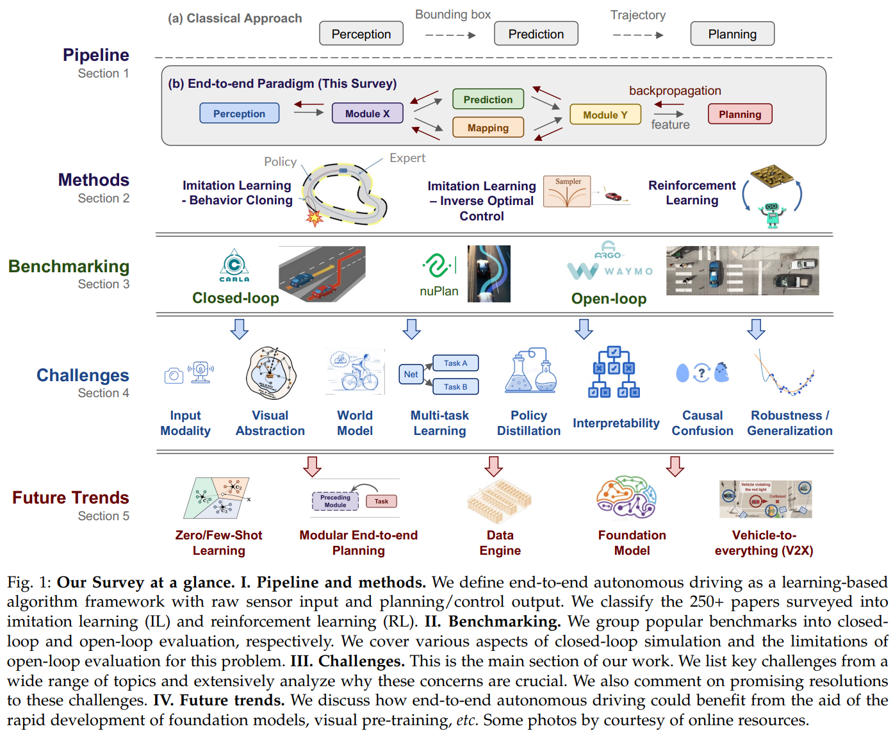

time: 20230703
pdf_source: https://arxiv.org/pdf/2306.16927.pdf
code_source: https://github.com/OpenDriveLab/End-to-end-Autonomous-Driving

# End-to-end Autonomous Driving: Challenges and Frontiers

CVPR2023 的 best paper [Planning-oriented Autonomous Driving](https://github.com/OpenDriveLab/UniAD), 整合了近年来BEV/Occupancy 预测的设计哲学，以及数据驱动 planning prediction的进展，使用多个transformer 网络，用 DETR embedding的梯度传递形式，在保留网络中间预测过程的情况下，实现了无人驾驶系统整体的端到端训练推理。

本文以近期的发展为锚点，阐述了端到端驾驶的前沿与难点，由UniAD所属 实验室和KITTI组联合发布。

## Summary from ChatGPT 
The survey paper on end-to-end autonomous driving provides a comprehensive analysis of the current research status, future challenges, and related considerations in the field. Here is a summary:

**Current Research Status:**
- The field of autonomous driving has seen a rapid growth in approaches that utilize an end-to-end algorithm framework. This framework uses raw sensor input to generate vehicle motion plans, instead of focusing on individual tasks such as detection and motion prediction.
- End-to-end systems, compared to modular pipelines, benefit from joint feature optimization for perception and planning. This has been made possible due to the availability of large-scale datasets, closed-loop evaluation, and the increasing need for autonomous driving algorithms to perform effectively in challenging scenarios.
- The end-to-end approaches can be broadly classified into imitation learning and reinforcement learning. Significant progress has been made with the development of deep neural networks in both these areas.
- A significant turning point occurred in 2021 for end-to-end autonomous driving. Attention was focused on incorporating more modalities and advanced architectures to capture global context and representative features.

**Future Challenges and Considerations:**
- **Data Engine:** The development of a data engine that can automatically collect, clean, and label data is a critical future challenge. This engine should also support mining hard/corner cases, scene generation, and editing to facilitate data-driven evaluations and promote diversity of data and the generalization ability of models.
- **Foundation Model:** The utilization of large-scale data and model capacity has unleashed the immense potential of AI in high-level reasoning tasks. However, the direct adoption of large language models (LLMs) for autonomous driving might seem misaligned due to the different goals of the two targets. A feasible solution to develop a large autonomous driving model is to train a video predictor that can forecast long-term predictions of the environment, either in 2D or 3D.
- **Vehicle-to-everything (V2X):** V2X systems offer promising solutions to address challenges such as occlusion and obstacles beyond the perceptual range. These systems could provide a solution to realize advanced decision intelligence among autonomous vehicles.

The paper concludes that end-to-end autonomous driving faces great opportunities and challenges simultaneously, with the ultimate goal of building generalist agents. Future endeavors to embrace the rapidly developed foundation models and data engines are discussed.
