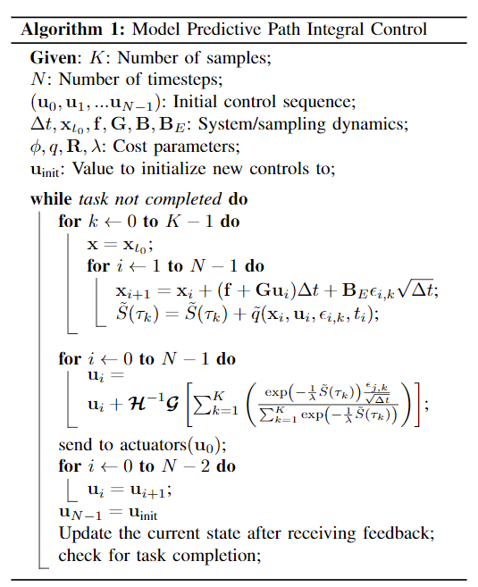

# Aggressive  Driving  with  Model  Predictive  Path  Integral  Control

本篇论文将Path integral Control使用在自动驾驶之中，Path integral Control属于随机最优控制的算法，概念大概是这样的，使用随机控制值进行探索与预测，然后与其选择其中最优的，综合各个点的成本以及行动轨迹，得到一个经验上的最优控制结果。

在每一个时刻：

1. 确定参数，随机采样数K，预测步长N，初始化N个初始的控制序列。
2. 对每一个采样点(并行进行)，加入随机扰动序列并往前预测N步，得到分别的总cost
3. 这里注意图中的$HG^{-1} = \gamma$是一个更新控制参数
4. 使用模型预测控制的思路，只执行第一个控制结果

实现细节：
1. 每一个采样点的预测更新以及求和可以用GPU并行完成(用上千个随机采样样本)
2. 在实时执行的时候，每个时刻只需要随机优化整个序列一步，序列后面地方可以使用前一个时间步时的优化结果。
3. 本文控制的时候还是对控制结果进行了平滑。

理论细节：
1. 要实现上文图中的算法这一化简，要求的是随机噪声的作用矩阵$B$的不可控制与可控制部分，不可以有相关项
2. $HG^{-1} = G_c^{-1} B_c$，$G_c$就是系统动态方程中的可控部分, $B_c$是布朗漂移对应的可控部分，在我们优化的时候往往两个矩阵是相同的(假设控制结果以及成本上是仿射的)，那么这个$\gamma = 1$为常态
3. $\lambda$是温度，会控制允许波动的自由能的大小,直觉结果是当$\lambda$越小的时候，结果更趋向直接取最优，当$\lambda$越大的时候，结果更趋向于随机选择。