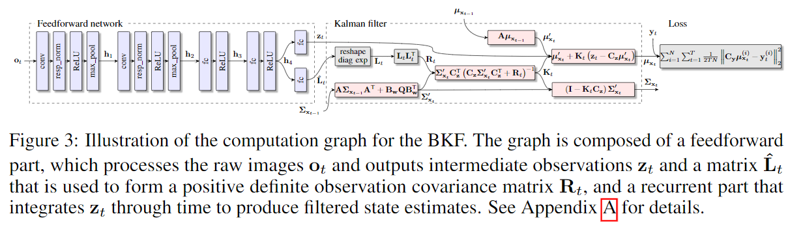

# Backprop KF: Learning Discriminative DeterministicState Estimators

这是一篇比较早期的论文，介绍的是可微分卡尔曼滤波。

## 核心结构

用CNN输出一维的观测矢量，以及观测的covariance矩阵。

观测的covariance矩阵的生成方式：

Relu->diag->square

其余中间公式与卡尔曼滤波一致，模型动态方程与观测方程皆(状态空间ABCD，Q矩阵)皆为可学习的参数