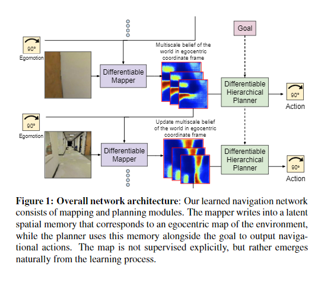
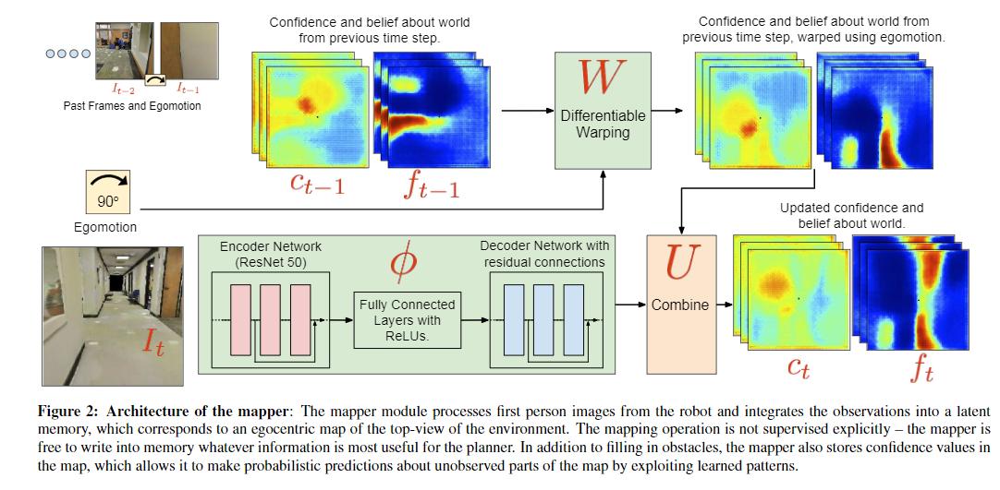
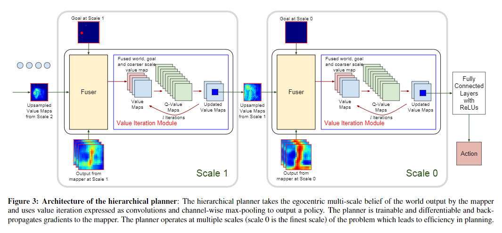

code_source: https://github.com/tensorflow/models/tree/master/research/cognitive_mapping_and_planning
pdf_source: https://arxiv.org/pdf/1702.03920.pdf
short_title: Cognitive Mapping and Planning
# Cognitive Mapping and Planning for Visual Navigation

这篇论文在2017年提出了直接利用视觉进行导航的思路

总体结构:

输入为Egomotion, Goal, 视觉图像输入, 输出时action，中间使用可微分Mapper和可微分Planner

## Mapper

这里给出的mapper结构如上图，已知上一时刻对环境建图结果以及本体运动，通过可微分的图片平移和旋转，得到对现在地图的估计，与新图片经过encoder、decoder之后的输出进行合并，得到当前世界的估计。

## Planner

这里给出的多层级Planner结构如上图，算法如下

1. 在最大的地图最小实际距离分辨率的costmap(来自mapper)上带着goal信息(卷积合成)，进行value-iteration(方法同QMDP中提到的planner的做法)
2. 分割出Value Map中心部分，下采样,与Goal和Costmap卷积合成，再进行value-iteration
3. 重复2，直到分辨率足够小为止，最终全连接输入行动值。

显然这个planner与Mapper都是可导的运算过程，可以端到端学习。缺点在于Value-iteration用于planner这个目前只在2D平面导航中观察过，有待考虑。
