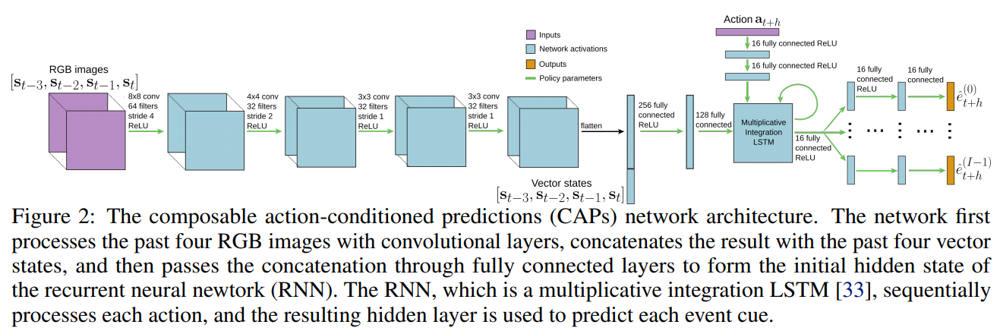

code_source: https://github.com/gkahn13/CAPs
pdf_source: https://arxiv.org/pdf/1810.07167.pdf
short_title: Composable Action-Conditioned Predictors
# Composable Action-Conditioned Predictors: Flexible Off-Policy Learning for Robot Navigation

这篇论文提出了一个灵活的、少监督的增强学习导航框架。模型的学习过程使用较为有限的监督，同一个模型可在deploy时通过修改reward函数是的机器人达到我们想要的导航效果

## CAPs模型介绍

CAPs结构的目的是通过输入的图片、状态序列，输出当前状态下几个重要的encoded event的相关参数。本论文使用的是collision, heading， or road lanes and doorways(门在图片中的比例)。过程是off-policy的，模型取决于一个长度为N的未来的action list，数据采集过程采用的policy与最终deploy没有必然联系。

在deploy的时候，用户基于encoded event定义新的reward function， 系统通过MPC优化实现控制。

### 深度学习结构

卷积提特征->concat状态向量->全连接->[multiplicative integration LSTM](../Building_Blocks/On_Multiplicative_Integration_with_Recurrent_Neural_Networks.md)的初始状态值->输入序列action->通过FC分支输出各个encoded event的参数

### encoded events (event cues)

这里选择的collision以及heading以及速度等可以通过车身传感器测得自动标注，road lanes和doorways这里使用了一个pretrained FCN进行语义分割直接得到结果

## 三个实验项目

### 仿真森林走动

奖励函数为：
$$
R\left(\hat{E}_{t}^{(H, I)}\right)=\sum_{t^{\prime}=t}^{t+H-1} 500 \cdot\left(1-\hat{e}_{t^{\prime}}^{(c o l l)}\right)+\left(\cos \left(\hat{e}_{t^{\prime}}^{(h e a d i n g)}-\mathrm{GOAL}_{-} \mathrm{HEADING}\right)-1\right)
$$

###　Carla仿真运行

奖励函数为

$$
\begin{aligned} R\left(\hat{E}_{t}^{(H, I)}\right)=& \sum_{t^{\prime}=t}^{t+H-1} 50 \cdot\left(1-\hat{e}_{t^{\prime}}^{(c o l l)}\right)-3 \cdot \frac{\left|\hat{e}_{t^{\prime}}^{(s p e e d)}-\operatorname{GOAL}_{-} \operatorname{SPEB}\right|}{\operatorname{GOAL}_{-} \operatorname{SPEED}}+5 \cdot \hat{e}_{t^{\prime}}^{(l a n e-s e e n)}\left(1-\left|\hat{e}_{t^{\prime}}^{\left(l a n e_{-} d i f f\right)}\right|\right) \\ &-\frac{5}{\pi} \cdot\left|\hat{e}_{t^{\prime}}^{(h e a d i n g)}-\operatorname{GOAL}_{-} \operatorname{HEADING}\right|-0.15 \cdot\left\|\mathbf{a}_{t^{\prime}}^{(s t e e r)}\right\|_{2}^{2} \end{aligned}
$$

需要预测的内容包括：碰撞、速度、可见道路比率、可见道路比率变化率、朝向

### 实际车辆运行

$$
R\left(\hat{E}_{t}^{(H, I)}\right)=\sum_{t^{\prime}=t}^{t+H-1}\left(1-\hat{e}_{t^{\prime}}^{(c o l l)}\right) \cdot\left[1-\frac{0.1}{\pi} \cdot\left|\hat{e}_{t^{\prime}}^{(h e a d i n g)}-\operatorname{coth}_{-} \operatorname{HEADING}\right|+0.05 \cdot \hat{e}_{t^{\prime}}^{(d o o r-f r a c)}\right]-0.01 \cdot\left\|\mathbf{a}_{t^{\prime}}\right\|_{2}^{2}
$$

需要预测的内容包括：碰撞、朝向、房间门占画面比率

它们为了训练Segmentation网络标注了训练过程中0.2%的图像数据。