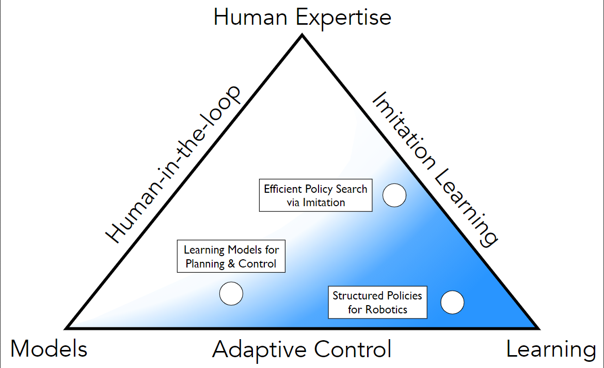

# Machine Learning for Robot Planning and Control from  Byron Boots Georgia Tech Robot Learning Lab

本文先讨论开车这个问题，并引出深度学习在机器人控制与规划中的利用的一个三角图。

## MPC
第一部分先集中讨论MPC，MPC是一个成功的算法以及解决问题的方式，但是大家普遍认为成功的传统MPC有一些问题。总结起来，MPC问题一是非线性(动力学与约束)，问题二是模型不准确。

然后介绍了[MPPI算法](./Aggressive_Driving_with_Model_Predictive_Path_Integral_Control.md)

这里描述的另一个问题是在使用MPPI算法实时学习的时候，存在一个探索的问题，输入需要丰富，同时与实际的输入分布相似。

要缓解这个问题，演讲者使用的其中一个方法是先用human driver得到初始数据，对模型进行初始训练(bootstrapping)。

## Imitation
接着我们讨论模仿学习以及在专家引导下的探索问题。

这里指向了 AggreVaTeD (Aggregate Values to Imitate) [Sun, Venkatraman, Gordon, Boots, Bagnell; ICML 2017]。 暂未收录此论文

## Parameterized a Robot

这里指向了differentiable MPC(这篇论文又很重要地参考了OptNet)，